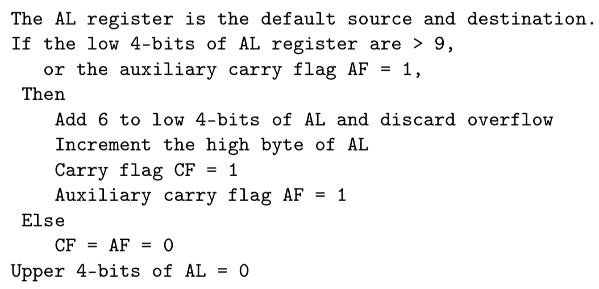
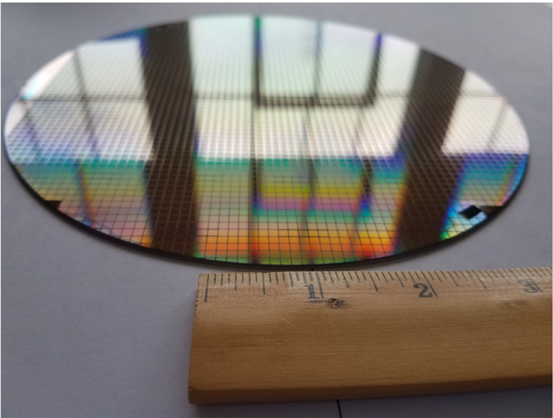
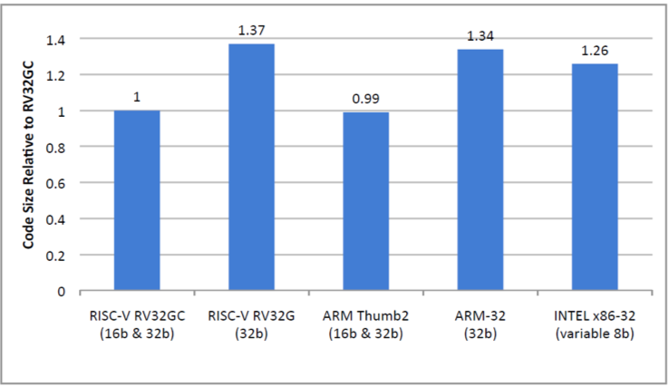

# 1. 为什么要有RISC-V？

简约是复杂的最终形式。 *------*列奥纳多·达·芬奇(Leonardo da Vinci)

>>> **列奥纳多·达·芬奇**(1452-1519)是一位文艺复兴时期的建筑师、工程师、雕塑家，同时也是一名画家，创作了著名的《蒙娜丽莎的微笑》。
>>> 

## 1.1 导言

RISC-V（"RISC five"）的目标是成为一个通用的指令集架构（ISA）：

- 它要能适应包括从最袖珍的嵌入式控制器，到最快的高性能计算机等各种规模的处理器。

- 它应该能兼容各种流行的软件栈和编程语言。

- 它应该适应所有实现技术，包括现场可编程门阵列（FPGA）、专用集成电路（ASIC）、全定制芯片，甚至未来的设备技术。

- 它应该对所有微体系结构样式都有效：例如微编码或硬连线控制;顺序或乱序执行流水线；单发射或超标量等等。

- 它应该支持广泛的专业化，成为定制加速器的基础，因为随着摩尔定律的消退，加速器的重要性日益提高。

- 它应该是稳定的，基础的指令集架构不应该改变。更重要的是，它不能像以前的专有指令集架构一样被弃用，例如AMD、Am29000、Digital Alpha、Digital VAX、Hewlett Packard PA-RISC、Intel i860、Intel i960、Motorola 88000、以及Zilog Z8000。

RISC-V的不同寻常不仅在于它是一个最近诞生的指令集架构（它诞生于最近十年，而大多数其他指令集都诞生于20世纪70到80年代），而且在于它是一个开源的指令集架构。与几乎所有的旧架构不同，它的未来不受任何单一公司的浮沉或一时兴起的决定的影响（这一点让许多过去的指令集架构都遭了殃）。它属于一个开放的，非营利性质的基金会。RISC-V基金会的目标是保持RISC-V的稳定性，仅仅出于技术原因缓慢而谨慎地发展它，并力图让它之于硬件如同Linux之于操作系统一样受欢迎。图1.1列出了RISC-V基金会最大的企业成员，作为其活力的证明。

>>> 我们在页边加入了侧边栏，是希望能在里面 放入一些有意思的评论。比如，RISC-V 最初是为加州大学伯克利分校的内部研究和课程开发的。外部人员的使用使它变得开放。RISC-V 架构师在开始收到有关网上 ISA 课程变化的投诉时就了解到了来自外部的兴趣。只有在架构师理解了需求之后，他们才会尝试把它变为一个开放的 ISA 标准。

**图1.1：2017年5月第六届RISC-V研讨会上RISC-V基金会的企业成员按年销售额排名。左栏公司的年销售额均超过500亿美元，中间栏目公司的销售额低于500亿美元但超过50亿美元，右栏的销售额低于50亿美元但超过5亿美元。RISC-V基金会包括另外25家小公司，5家初创公司（Antmicro Ltd，Blockstream，Esperanto Technologies，Greenwaves Technologies和SiFive），4家非营利组织（CSEM，Draper Laboratory，ICT和lowRISC）和6所大学（ETH Zurich，IIT Madras，National University of Defense Technology，Princeton和UC Berkeley）。60个组织中的大多数总部都在美国以外。要了解更多信息，请访问[www.riscv.org](http://www.riscv.org)。**

**图1.2：x86指令集自诞生以来指令数量的增长。x86在1978年诞生时有80条指令，到2015年增长了16倍，到了1338条指令，并且仍在增长。令人惊讶的是这张图的数据仍显保守。2015年在英特尔的博客上有着3600条指令的统计结果\[Rodgers and Uhlig 2017\]，这意味着x86指令的增长速率提高到了（在1978年到2015年之内）每四天增长一条。我们是用汇编语言指令计算的，他们想必算入了机器语言指令。正如第八章所解释的那样，这个增长的很大一部分是因为x86 ISA依赖于SIMD指令来实现数据级并行。**

**图1.3：x86-32 ASCII Adjust after Addition（aaa）指令的描述。它以二进制编码十进制数（BCD）形式进行计算机运算，这种方式已经被扔进信息技术历史的垃圾堆里。x86还有三个相似的指令，分别执行减法操作（aas），乘法操作（aam），和除法操作（aad）。由于他们都是单字节指令，它们加起来占用了宝贵的操作码空间的1.6%（4/256）。**

## 1.2 模块化与增量型ISA

*英特尔曾将其未来押在高端微处理器之上，但那时还需要很多年时间。为了对抗Zilog，英特尔开发了一款过渡产品，并给它起名为8086。它本应该是短命的，没有任何继任者，但事情并非如此。高端处理器姗姗来迟，等它最终出现时，它的性能并不如人意。因此，8086架构延续了下去------它变成32位处理器，最终演变为了64位处理器。它的名称不断变化（80186，80286，i386，i486，Pentium），但基础指令集保持不变。*

------Stephen P. Morse, 8086的架构师\[Morse 2017\]

计算机体系结构的传统方法是增量ISA，新处理器不仅必须实现新的ISA扩展，还必须实现过去的所有扩展。目的是为了保持向后的二进制兼容性，这样几十年前程序的二进制版本仍然可以在最新的处理器上正确运行。这一要求与来自于同时发布新指令和新处理器的营销上的诱惑共同导致了ISA的体量随时间大幅增长。例如，图1.2显示了当今主导 ISA 80x86 的指令数量增长过程。这个指令集架构的历史可以追溯到1978年，在它的漫长生涯中，它平均每个月增加了大约三条指令。

这个传统意味着 x86-32（我们用它表示32位地址版本的x86）的每个实现必须实现过去的扩展中的错误设计，即便它们不再有意义。例如，图1.3描述了 x86 的 ASCII Adjust after Addition（aaa）指令，该指令早已失效。

作为一个类比，假设一家餐馆只提供固定价格的餐点，最初只是一顿包含汉堡和奶昔的小餐。随着时间的推移，它会加入薯条，然后是冰淇淋圣代，然后是沙拉，馅饼，葡萄酒，素食意大利面，牛排，啤酒，无穷无尽，直到它成为一顿大餐。食客可以在那家餐厅找到他们过去吃过的东西，尽管总的来说这样做可能没什么意义。这样做的坏处是，用餐者为每次晚餐支付的宴会费用不断增加。

RISC-V的不同寻常之处，除了在于它是最近诞生的和开源的以外，还在于：和几乎所有以往的ISA不同，它是模块化的。它的核心是一个名为*RV32I*的基础ISA，运行一个完整的软件栈。RV32I是固定的，永远不会改变。这为编译器编写者，操作系统开发人员和汇编语言程序员提供了稳定的目标。模块化来源于可选的标准扩展，根据应用程序的需要，硬件可以包含或不包含这些扩展。这种模块化特性使得RISC-V具有了袖珍化、低能耗的特点，而这对于嵌入式应用可能至关重要。RISC-V编译器得知当前硬件包含哪些扩展后，便可以生成当前硬件条件下的最佳代码。惯例是把代表扩展的字母附加到指令集名称之后作为指示。例如，RV32IMFD将乘法（RV32M），单精度浮点（RV32F）和双精度浮点（RV32D）的扩展添加到了基础指令集（RV32I）中。

>>> 如果软件使用来自可选扩展的省略的RISC-V指令，则硬件会在软件中捕获并执行所需的功能，作为标准库的一部分。

继续用我们刚才的类比来说，RISC-V提供的是菜单，而不是一顿应有尽有的自助餐。主厨只需要烹饪顾客需要的东西（而不是每次都做出一顿盛宴），顾客只需要按他们的订单付费。RISC-V无需仅仅为了市场吸引力而添加指令。RISC-V基金会会决定什么时候在菜单里添加新的选项，而他们只会出于技术原因这样做，而且要在由软硬件专家组成的委员会进行专门的公开讨论以后才会添加。即使那些新选择出现在了菜单上，它们仍是可选的，不会像在增量ISA中那样成为未来所有实现的必要组成部分。

## 1.3 ISA设计 101

在介绍RISC-V这个ISA之前，了解计算机架构师在设计ISA时的基本原则和必须做出的权衡是有用的。如下的列表列出了七种衡量标准。页边放置了对应的七个图标，以突出显示RISC-V在随后章节中应对它们的实例。（印刷版的封底有所有图标的图例。）

-   成本（美元硬币）
-   简洁性（轮子）
-   性能（速度计）
-   架构和具体实现的分离（分开的两个半圆）
-   提升空间（手风琴）
-   程序大小（相对的压迫着一条线的两个箭头）
-   易于编程/编译/链接（儿童积木"像ABC一样简单"）

      

为了解释我们的意思，在这一节中我们会展示一些以往 ISA 所作出的选择。它们现在看起来是不明智的，而 RISC-V 通常会做出更好的决定。

**成本** 处理器通过集成电路实现，通常称为芯片或晶粒。它们叫做晶粒是因为，它们由一些单个的圆形晶片被切割成许多单独的片得到。图1.4显示了RISC-V处理器的晶圆。成本对晶粒面积十分敏感：

$$ cost ≈ f(die\  area^2) $$

显然，晶粒越小，每个晶圆上能切割出来的晶粒越多。晶粒的大部分成本来自于处理过的晶圆本身。不太直观的是，晶粒越小，产率（生产出的可用晶粒所占的比例）越高。原因在于目前的硅生产工艺会在晶圆上留下一些散布的小瑕疵。因此晶粒越小，有缺陷部分所占比重会越低。

**图1.4：由SiFive设计的直径为8英寸的RISC-V晶圆。它有两种类型的RISC-V芯片，使用较旧的较大加工线。FE310芯片为2.65mm×2.72mm，SiFive测试芯片为2.89mm×2.72mm。一片晶圆上有1846片FE310和1866片SiFive测试芯片，总共3712个芯片。**

架构师希望保持ISA的简洁性，从而缩小实现ISA的处理器的尺寸。我们将在随后的章节看到，RISC-V ISA比ARM-32 ISA简洁得多。就简洁性造成的影响举例，我们把使用相同大小缓存（16KiB）的RISC-V Rocket处理器和采用相同技术（TSMC40GPLUS）的ARM-32 Cortex A5处理器进行比较。RISC-V晶粒的大小是$$0.27mm^2$$，而ARM-32晶粒的大小是$$0.53mm^2$$。由于面积大一倍，ARM-32 Cortex A5的晶粒成本是RISC-V Rocket的约$$4X（2^2）$$倍。即使晶粒的大小只缩小10%，成本也将以$$1.2（1.1^2）$$倍的比例缩小。

>>> **高端处理器**可以通过将简单的指令组合在一起来提升性能，而不会因更大，更复杂的ISA给所有低端实现带来负担。这种技术称为宏观融合，因为它将“宏”指令融合在一起。

**简洁性** 鉴于成本对于复杂度的敏感性，架构师需要一个简单的ISA来缩小芯片面积。ISA的简洁性还能缩短芯片的设计和验证时间，而它们可能构成了芯片开发的大部分成本。这些成本必须算到芯片的成本当中。这个开销取决于发货芯片的数量。简洁性还能降低文档成本，让客户更容易了解如何使用这个ISA。

以下是ARM-32的ISA复杂性的一个明显示例：

ldmiaeq SP!, {R4-R7, PC}

>>> 
>>> **简单的处理器对嵌入式应用程序有益**，因为它更容易预测执行时间。微控制器的汇编语言程序员通常希望保持精确的时序，因此他们会保持代码执行所需的时钟周期数可预测并可以手动数出来。

该指令代表LoaD Multiple, Increment-Address, on EQual。它执行5次数据加载并写入6个寄存器，但仅当EQ条件码置位时才执行。此外，它将结果写入PC，因此它也执行条件分支。真不少！

具有讽刺意味的是，即便需要实现的功能相同，简单指令也通常比复杂指令更容易被用到。例如，x86-32有一个enter指令，该指令本应该是在进入一个创建一个栈帧的过程中执行的第一条指令（见第三章）。大多数编译器用两条简单的x86-32指令来代替它：

push ebp # 将帧指针压入栈

 
mov ebp, esp # 把栈指针复制到帧指针

**性能** 除非是那些用于嵌入式应用的微型芯片，处理器的性能和成本通常都能成为架构师的关注对象。性能可以分解为如下三个因素：

$$\frac{\text{instructions}}{\text{program}} \times \frac{\text{average clock cycles}}{\text{instruction}} \times \frac{\text{time}}{\text{clock cycle}} = \frac{\text{time}}{\text{program}}$$

即使一个简单的 ISA 可能在每个程序执行的指令数方面多于复杂的ISA，但它可以通过更快的时钟频率或更低的平均单条指令周期数（CPI）来弥补。

>>> 
>>> 最后一个因素是时钟频率的倒数，因此1 GHz时钟频率意味着每个时钟周期的时间为$$1 ns（1 / 10^9）$$。

例如，运行CoreMark测试程序\[Gal-On, Levy2012\]（100000次迭代）后，得到 ARM-32 Cortex-A9 的性能为：

$$\frac{32.27\ B\ instructi\text{ons}}{\text{program}} \times \frac{0.79\ clock\ cycles}{\text{instruction}} \times \frac{0.71\ ns}{\text{clock cycle}} = \frac{18.15\ \text{secs}}{\text{program}}$$

对应地，RISC-V 的 BOOM 实现的性能为：

$$\frac{29.51\text{ B instructi}\text{ons}}{\text{program}} \times \frac{0.72\text{ clock cycles}}{\text{instruction}} \times \frac{0.67\text{ ns}}{\text{clock cycle}} = \frac{14.26\ \text{secs}}{\text{program}}$$

>>> 平均时钟周期数可以小于1，因为A9和BOOM [Celio et al. 2015]是所谓的超标量处理器，每个时钟周期执行多个指令。

在这个例子中，ARM处理器执行的指令并不比RISC-V处理器少。正如我们将要看到的，简单的指令也是最常用到的指令，因此ISA的简洁性是最为重要的指标。对于这个程序，RISC-V处理器在这三个因素中的每一个都获得了近10%的优势，它们加起来导致了近30%的性能优势。如果更简洁的ISA也能催生出更小的芯片，那么其性价比将非常出色。

**架构和具体实现的分离** 架构和实现之间最初的分离可以追溯到20世纪60年代，具体表现为：机器语言程序员了解架构后能写出正确的程序，却不一定能保证性能。对于架构师来说，为了在性能和成本上对某一特定时间的某种实现进行优化，而在ISA中包含某些指令，有时候是一件有诱惑性的事情。但这样做会给其他实现或者今后的实现带来负担。

延迟分支是MIPS-32 ISA的一个令人遗憾的例子。条件分支导致流水线执行出现问题，因为处理器希望下一条要执行的指令总是已经在流水线上，但它不能确定它要的到底是顺序执行的下一条（如果分支未执行），还是分支目标地址的那一条（如果执行了分支）。对于它们的第一个五级流水的微处理器，这种优柔寡断可能导致流水线一个时钟周期的阻塞。MIPS-32通过把分支操作重新定义在分支指令的下一条指令执行完之后发生，因此分支指令的下一条指令永远会被执行。程序员或编译器编写者要做的是把一些有用的指令放入延迟槽。

>>>  
>>>  **今天的流水线处理器预测分支结果**使用的是硬件预测器，这种方法的准确度可以超过90％，并且适用于任何大小的流水线。他们只需要一种机制来刷新和重启流水线。

唉，这个"解决方案"对接下来有着更多流水级（于是在计算出分支结果之前取了更多的指令）的MIPS-32处理器并无益处，反而让MIPS-32程序员，编译器编写者，以及处理器设计者（因为增量ISA需要向后兼容，见1.2节）的生活变得更加艰难。此外，它让MIPS-32的代码变得更加难懂（参见第29页图2.10）。

虽然架构师不该为了有助于某个时间点的某一个特定实现而特意加入某些功能，但他们也不应该放入阻碍某些实现的功能。例如，如上一页所述，ARM-32和其他一些ISA具有Load Multiple指令。这些指令可以提高单发射流水线设计的性能，但会降低多发射流水线的效率。原因在于这种直截了当的实现排除了与其他指令并行地调度Load Multiple的各个负载的可能，从而降低了这些处理器的指令吞吐量。

**提升空间** 随着摩尔定律（Moore's law）的终结，对性价比进行重大改进的唯一途径是为特定领域（例如深度学习，增强现实，组合优化，图形等）添加自定义指令。这意味着如今的ISA必须保留操作码空间以供未来的提升。

>>>  
>>>  **上面提到的ARM-32指令ldmiaeq甚至更复杂**，因为当它分支时它也可以将ARM-32从Thumb/Thumb-2两种模式中切换。

在20世纪70年代和80年代，当摩尔定律如日中天的时候，很少有人考虑为未来的提升节省操作码空间。相反，架构师们重视长地址和立即数字段以减少每个程序执行的指令数（这是前一页上有关性能的方程式中的第一个因素）。

一个能说明缺少操作码空间的弊端的例子是，ARM-32的架构师后来试图通过向以前统一的32位ISA中添加16位指令来缩减代码长度，但根本就没有空间了。因此，唯一的解决方案是先用16位指令来创建一个新的ISA（Thumb），然后同时用16位指令和32位指令来组成另外一个ISA（Thumb-2），并用一个模式位在两种长度的指令间切换。为了切换模式，程序员或编译器会跳转到一个最低有效位为1的字节地址。这种方法有效的前提是，在正常的16位和32位指令中，该位应该是0。

**图1.5：RV32G，ARM-32，x86-32，RV32C和Thumb-2程序的相对大小。最后两个ISA是以短代码长度为目标的。这些程序是使用GCC编译器的SPEC CPU2006基准测试。与RV32C相比，Thumb-2的代码短小的优势是由于在进入程序时Load and Store Multiple的节省。RV32C没有包含它们，以保持与RV32G指令的一对一映射，RV32G省略了Load and Store Multiple以降低高端处理器的实现复杂性（见下文）。第七章介绍了RV32C。RV32G表示RISC-V扩展（RV32M，RV32F，RV32D和RV32A）的流行组合，正确称 RV32IMAFD。\[Waterman 2016\]**

**程序大小** 程序越小，存储它所需的芯片面积就越小(这对于嵌入式设备来说可能是一个巨大的成本)。实际上，这个问题促使ARM架构师在Thumb和Thumb-2 ISA中追加了一些更短的指令。更小的程序还能减少指令缓存的未命中问题，从而节省了功耗（因为片外DRAM访问比片上SRAM访问耗能更多），也提高了性能。短的代码长度是ISA架构师的目标之一。

>>> 
>>> **例如一个15字节的x86-32指令是**lock add dword ptr ds：[esi+ecx*4+0x12345678]，0xefcdab89。它汇编成（十六进制）：67 66 f0 3e 81 84 8e 78 56 34 12 89 ab cd ef。 最后8个字节是2个地址，前7个字节指定原子的存储器操作，加操作，32位数据，数据段寄存器，2个地址寄存器和缩放索引寻址模式。 1字节指令的例子是汇编成40的指令inc eax。

x86-32 ISA的指令可以短至1字节，也可以长达15字节。你可能会觉得x86的这种可变字节长度的指令写成的程序一定会比用一些ISA（比如ARM-32，RISC-V）中32位定长指令写的要更短。逻辑上，可变字节长度指令的程序也应该小于仅由16位和32位定长指令组成的ISA（比如Thumb-2和使用RV32C扩展的RISC-V，参见第七章）。图1.5显示，当所有指令都是32位长时，ARM-32和RISC-V代码比x86-32长6%到9%，而令人惊讶的是，x86-32代码比同时提供16位和32位指令的压缩版本（Thumb-2和RV32C）大26%。

虽然使用新的可变字节长度指令的新ISA可能会导致比RV32C和Thumb-2更短的代码，但20世纪70年代设计第一个x86的架构师并不关心这个问题。此外，考虑到增量ISA（第1.2节）对于向后二进制兼容性的要求，数百条新的x86-32指令比预期要长。它们有着一到两个字节长前缀的负担，这迫使它们使用原始x86的有限的空余操作码空间。

**易于编程/编译/链接** 由于寄存器中的数据访问起来要比存储器中的快得多，编译器在寄存器分配方面一定要做得很好。这件事在有许多寄存器的时候变得更加容易。鉴于这一点，ARM-32有16个寄存器，而x86-32只有8个。大多数现代ISA（包括RISC-V）都有32个整型寄存器。毫无疑问，有了更多的寄存器，编译器和汇编程序员的工作会更加轻松。

>>> 
>>> _

编译器和汇编语言程序员的另一个问题是弄清楚一个代码序列的执行速度。我们可以看到，一般每条RISC-V指令最多用一个时钟周期执行（忽略缓存未命中）。但正如我们之前看到的，ARM-32和x86-32都有需要很多个时钟周期执行（即使所有缓存都命中）的指令。此外，与ARM-32和RISC-V不同，x86-32的算术指令操作数可以在存储器中，而不必都在寄存器里。复杂的指令和位于存储器中的操作数使得处理器的设计人员难以保证性能的可预测性。

ISA支持位置无关代码（PIC）非常有用，因为这样它就支持动态链接（参见第3.5节），原因在于在不同程序中共享库代码可以驻留在不同地址。PC相关的分支和数据寻址是PIC的福音。虽然几乎所有的ISA都提供与PC相关的分支，但x86-32和MIPS-32省略了与PC相关的数据寻址。

**补充说明：ARM-32，MIPS-32和x86-32**

这是一个可选部分，如果对某个主题感兴趣的话，读者可以深入研究它们，但它们对于理解本书的其余部分并不必要。例如，我们对于ISA的称呼不是官方名称。32位地址ARM ISA有许多版本，第一个诞生于1986年，最新版本在2005年出现，称为ARMv7。ARM-32通常是指ARMv7 ISA。MIPS也有许多32位版本，但我们指的是原版，称为MIPS I（“MIPS32”是一个更新的，不同于我们称之为MIPS-32的ISA）。英特尔的第一个16位地址架构是 1978年的8086，其中80386 ISA在1985年扩展到32位地址。我们的x86-32表示法通常是指IA-32，它的x86 ISA的32位地址版本。鉴于这些ISA的数不清的变体的存在，我们发现我们的非标准术语反而最不容易混淆。

## 1.4 全书总览

本书假设您在RISC-V之前已经了解过其他指令集。如果没有，请查看我们基于RISC-V的相关入门架构书\[Patterson and Hennessy 2017\]。

第二章介绍了RV32I，它是RISC-V固定不变的基础整数指令集，是RISC-V的核心内容。第三章解释了第二章中没有介绍的其余RISC-V汇编语言内容，包括调用约定和一些用于链接的巧妙技巧。汇编语言包括所有符合规则的RISC-V指令和一些RISC-V指令集外的有用指令。这些伪指令是实际指令的巧妙变体，它们简化了编写汇编语言程序的过程，同时避免了使ISA复杂化。

接下来的三章阐述了RISC-V的标准扩展。当它们添加到RIV32I中的时候，我们统称RV32G（G代表一般）：

- 第四章：乘法和除法（RV32M）
- 第五章：浮点操作（RV32F和RV32D）
- 第六章：原子操作（RV32A）

第3页和第4页的RISC-V"参考卡"是本书中所有RISC-V指令（RV32G，RV64G和RV32/64V）的摘要。

>>> 参考卡也被称为绿色卡片，这来源于20世纪60年代的ISA的单页纸板摘要的背景颜色的阴影。为了易读性，我们将背景保持白色，而不是延续历史而使其为绿色。

第七章介绍了可选的压缩扩展RV32C，它是RISC-V优雅性的一个绝佳例子。通过把16位指令限制为现有32位RV32G指令的短版本，它们几乎是没有代价的。汇编程序可以选择指令大小，这使得汇编语言程序员和编译器忘记RV32C。将16位RV32C指令转换成32位RV32G指令的硬件解码器只需要400个门，这即使在最简单的RISC-V实现中也只占百分之几。

第八章介绍了向量扩展RV32V。当与众多强大的单指令多数据*（SIMD）*指令（ARM-32，MIPS-32，x86-32）相比时，向量指令成为了ISA优雅性的另一个例证。实际上，图1.2中添加到x86-32的数百条指令都是SIMD，还有数百条指令即将问世。RV32V甚至比大多数向量ISA更简单，因为它通过向量寄存器指定数据类型和长度，而不是将这两者嵌入到操作码中。RV32V也许是大家从传统的基于SIMD的ISA转到RISC-V的最为可能的原因。

第九章展示了RV64G，它是RISC-V的64位地址版本。正如该章节所说的那样，RISC-V的架构师只需要拓宽寄存器，并加入一些字、双字或长版的RV32G指令，就可以把地址从32位扩展为64位。

第十章介绍了系统指令，说明了RISC-V如何处理分页以及机器、用户和监管者权限模式。

最后一章简要介绍了RISC-V基金会目前正在考虑增加的其它扩展。

接下来是本书最大的一个部分，附录A。它是按字母表顺序排列的指令集摘要。它定义了完整的RISC-V ISA以及上面提到的所有扩展，还有大概50页的全部伪指令。这是RISC-V简洁性的证明。

这本书的最后一部分是索引。

## 1.5 结束语

*用形式逻辑的方法可以很容易看出，存在某种\[指令集\]在理论上足以控制和执行任意顺序的操作......从当前的观点出发，选择一个\[指令集\]时考虑得更多更实际的问题是：\[指令集\]要求的设备简单性，在实际重要的问题中有明确应用和解决该类问题的速度。*
---- 冯·诺伊曼（von Neumann）等，1947

>>> 
>>> **冯·诺伊曼先前版本的精心编写的报告**非常有影响力，以至于这种计算机通常被称为冯·诺伊曼架构，尽管这份报告是基于其他人的工作。它是在第一台存储程序计算机开始运行的三年前编写的！

RISC-V是一个最新的，清晰的，简约的，开源的ISA，它以过去ISA所犯过的错误为鉴。RISC-V架构师的目标是让它在从最小的到最快的所有计算设备上都能有效工作。遵循冯诺依曼70年前的建议，这个ISA强调简洁性来保证它的低成本，同时有着大量的寄存器和透明的指令执行速度，从而帮助编译器和汇编语言程序员将实际的重要问题转换为适当的高效代码。

**图1.6：ISA手册的页数和字数来自\[Waterman and Asanovi\'c 2017a\]，\[Waterman and Asanovi\'c 2017b\]，\[Intel Corporation 2016\]，\[ARM Ltd. 2014\]。读完需要的时间按每分钟读200个单词，每周读40小时计算。基于\[Baumann 2017\]的图1的一部分。**

复杂度的一个标准是文档的大小。图1.6显示了以页数和单词数衡量的RISC-V、ARM-32和x86-32指令集手册的大小。如果你把读手册作为全职工作，每天8小时，每周5天，那么需要半个月读完ARM-32手册，需要整整一个月读完x86-32手册。有这样的复杂程度，大概没有一个人能完全理解ARM-32或x86-32。用这种常识来度量，RISC-V的复杂度只有ARM-32的$$\frac{1}{12}$$,x86-32的$$\frac{1}{10}$$到$$\frac{1}{30}$$。实际上，包含所有扩展的RISC-V ISA摘要只有两页（参见参考卡）。

>>> 
>>> _

这个袖珍的，开源的ISA于2011年推出，现在由一个基金会提供支持。该基金会通过长期讨论后严格依据技术理由添加可选扩展的方式来改进它。开源性让RISC-V的免费的、共享的实现成为可能，从而降低了成本，也减少了将不为人知的邪恶秘密隐藏在处理器之中的可能性。

然而，只有硬件不能组成一个系统。软件开发成本可能使硬件开发成本相形见绌。因此虽然稳定的硬件很重要，但稳定的软件更甚于此。这些软件需要包括操作系统，引导加载程序，参考软件和大众化的软件工具。基金会保证整个ISA的稳定性，而固定不变的基础指令集意味着核心的RV32I作为软件栈的目标永远不会改变。通过它的普适性和开源性，RISC-V可以挑战主流专有ISA的主导地位。

优雅是一个很少应用于ISA的词，但在阅读本书后，你可能会同意我们把它用于RISC-V。我们将用页边的蒙娜丽莎图标来凸显我们认为体现出优雅性的特征。

>>> 
>>> _

## 1.6 扩展阅读

ARM Ltd. ARM Architecture Reference Manual: ARMv7-A and ARMv7-R Edition, 2014. URL <http://infocenter.arm.com/help/topic/com.arm.doc.ddi0406c/>.

A. Baumann. Hardware is the new software. In *Proceedings of the 16th Workshop on Hot Topics in Operating Systems*, pages 132--137. ACM, 2017.

C. Celio, D. Patterson, and K. Asanovic. The Berkeley Out-of-Order Machine (BOOM): an industry-competitive, synthesizable, parameterized RISC-V processor. *Tech. Rep. UCB/EECS-2015--167, EECS Department, University of California, Berkeley*, 2015.

S. Gal-On and M. Levy. Exploring CoreMark - a benchmark maximizing simplicity and efficacy. *The Embedded Microprocessor Benchmark Consortium*, 2012.

Intel Corporation. *Intel 64 and IA-32 Architectures Software Developer's Manual, Volume 2: Instruction Set Reference*. September 2016.

S. P. Morse. The Intel 8086 chip and the future of microprocessor design. *Computer*, 50(4): 8--9, 2017.

D. A. Patterson and J. L. Hennessy. *Computer Organization and Design RISC-V Edition: The Hardware Software Interface*. Morgan Kaufmann, 2017.

S. Rodgers and R. Uhlig. X86: Approaching 40 and still going strong, 2017.

J. L. von Neumann, A.W. Burks, and H. H. Goldstine. Preliminary discussion of the logical design of an electronic computing instrument. *Report to the U.S. Army Ordnance Department*, 1947.

A. Waterman. *Design of the RISC-V Instruction Set Architecture*. PhD thesis, EECS Department, University of California, Berkeley, Jan 2016. URL <http://www2.eecs.berkeley.edu/Pubs/TechRpts/2016/EECS-2016-1.html>.

A. Waterman and K. Asanovi´c, editors. *The RISC-V Instruction Set Manual Volume II: Privileged Architecture Version 1.10*. May 2017a. URL <https://riscv.org/specifications/privileged-isa/>.

A. Waterman and K. Asanovi´c, editors. *The RISC-V Instruction Set Manual, Volume I: User-Level ISA, Version 2.2*. May 2017b. URL <https://riscv.org/specifications/>.

## 注

[^1] http://parlab.eecs.berkeley.edu
