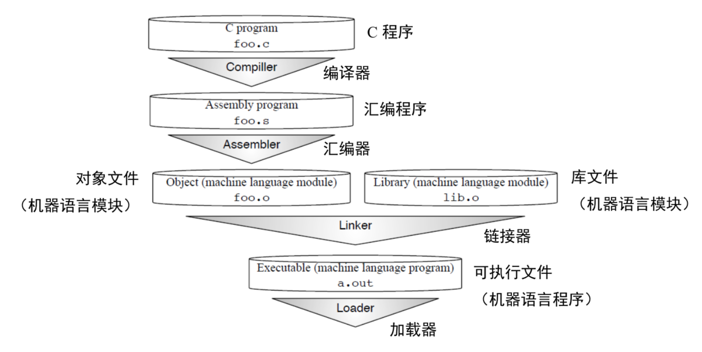
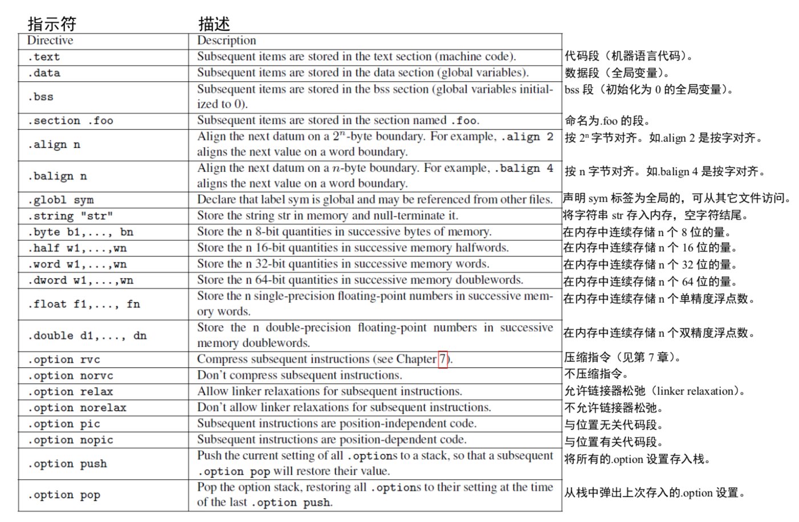

# 3. RISC-V汇编语言

*给看似困难的问题找到简单的解法往往让人心满意足，而且最好的解法常常是都简单的。*

<div align=right>—— Ivan Sutherland<div>

>>>**Ivan Sutherland**（1938 -），因为在1962年发明出Sketchpad而获得图灵奖，被誉为计算机图形学之父。Sketchpad是现代计算机的图形用户界面的先驱。
>>>

## 3.1 导言

图3.1表明了从C程序翻译成为可以在计算机上执行的机器语言程序的四个经典步骤。这一章的内容包括了后三个步骤，不过我们要从汇编语言在RISC-V函数调用规范中的作用开始说起。



<center>图3.1 从C源代码翻译为可运行程序的步骤。这是从逻辑上进行的划分，实际中一些步骤会被结合起来，加速翻译过程。我们在这里使用了Unix的文件后缀命名习惯，分别对应MS-DOS中的.C，.ASM， .OBJ，.LIB和.EXE。</center>

## 3.2 函数调用规范（Calling convention）

函数调用过程通常分为6个阶段\[Patterson and Hennessy 2017\]。

1. 将参数存储到函数能够访问到的位置；

2. 跳转到函数开始位置（使用RV32I的jal指令）；

3. 获取函数需要的局部存储资源，按需保存寄存器；

4. 执行函数中的指令；

5. 将返回值存储到调用者能够访问到的位置，恢复寄存器，释放局部存储资源；

6. 返回调用函数的位置（使用ret指令）。

为了获得良好的性能，变量应该尽量存放在寄存器而不是内存中，但同时也要注意避免频繁地保存和恢复寄存器，因为它们同样会访问内存。

>>>

RISC-V有足够多的寄存器来达到两全其美的结果：既能将操作数存放在寄存器中，同时也能减少保存和恢复寄存器的次数。其中的关键在于，在函数调用的过程中不保留部分寄存器存储的值，称它们为临时寄存器；另一些寄存器则对应地称为保存寄存器。不再调用其它函数的函数称为叶函数。当一个叶函数只有少量的参数和局部变量时，它们可以都被存储在寄存器中，而不会"溢出（spilling）"到内存中。但如果函数参数和局部变量很多，程序还是需要把寄存器的值保存在内存中，不过这种情况并不多见。

函数调用中其它的寄存器，要么被当做保存寄存器来使用，在函数调用前后值不变；要么被当做临时寄存器使用，在函数调用中不保留。函数会更改用来保存返回值的寄存器，因此它们和临时寄存器类似；用来给函数传递参数的寄存器也不需要保留，因此它们也类似于临时寄存器。对于其它一些寄存器，调用者需要保证它们在函数调用前后保持不变：比如用于存储返回地址的寄存器和存储栈指针的寄存器。图3.2列出了寄存器的RISC-V应用程序二进制接口（ABI）名称和它们在函数调用中是否保留的规定。
|寄存器|接口名称|描述|是否跨调用保留？|
|-|-|-|-|
|x0|zero|硬编码0|—|
|x1|ra|返回地址|否|
|x2|sp|栈指针|是|
|x3|gp|全局指针|—|
|x4|tp|线程指针|—|
|x5|t0|临时寄存器/备用链接寄存器|否|
|x6-7|t1-2|临时寄存器|否|
|x8|s0/fp|被保存寄存器/帧指针|是|
|x9|s1|被保存寄存器|是|
|x10-11|a0-1|函数参数/返回值|否|
|x12-17|a2-7|函数参数|否|
|x18-27|s2-11|被保存寄存器|是|
|x28-31|t3-6|临时寄存器|否|
|f0-7|ft0-7|浮点临时寄存器|否|
|f8-9|fs0-1|浮点被保存寄存器|是|
|f10-11|fa0-1|浮点参数/返回值|否|
|f12-17|fa2-7|浮点参数|否|
|f18-27|fs2-11|浮点被保存寄存器|是|
|f28-31|ft8-11|浮点临时寄存器|否|

<center>图3.2 RISC-V整数和浮点寄存器的汇编助记符。RISC-V有足够的寄存器，如果过程或方法不产生其它调用，就可以自由使用由ABI分配的寄存器，不需要保存和恢复。调用前后不变的寄存器也称为"由调用者保存的寄存器"，反之则称为"由被调用者保存的寄存器"。浮点寄存器将第5章进行解释。（这张图源于\[Waterman and Asanovi´c 2017\]的表20.1。）</center>

根据ABI规范，我们来看看标准的RV32I函数入口和出口。下面是函数的开头：

```assembly
entry_label:
	addi sp,sp,-framesize 	# 调整栈指针(sp 寄存器)分配栈帧
	sw   ra,framesize-4(sp)	# 保存返回地址(ra 寄存器)
	# 按需保存其它寄存器
	... # 函数体
```

如果参数和局部变量太多，在寄存器中存不下，函数的开头会在栈中为函数帧分配空间，来存放。当一个函数的功能完成后，它的结尾部分释放栈帧并返回调用点：

```assembly
# 按需恢复其它寄存器
lw   ra,framesize-4(sp)	            # 恢复返回地址
addi sp,sp, framesize               # 释放栈帧空间
ret                                 # 返回到调用点
```

我们很快将会看到使用这套ABI的一个例子，但首先我们需要对汇编的其它部分进行一些解释。

>>**补充说明:保存寄存器和临时寄存器为什么不是连续编号的?**
>>为了支持 RV32E——一个只有 16 个寄存器的嵌入式版本的 RISC-V(参见第 11 章)，只使用寄存器 x0 到 x15——一部分保存寄存器和一部分临时寄存器都在这个范围内。其它的保存寄存器和临时寄存器在剩余 16 个寄存器内。RV32E 较小，但由于和 RV32I 不匹配，目前还没有编译器支持。

## 3.3 汇编器

>>>

在Unix系统中，这一步的输入是以.s为后缀的文件，比如foo.s；在MS-DOS中则是.ASM。

图3.1中的汇编器的作用不仅仅是从处理器能够理解的指令产生目标代码，还能翻译一些扩展指令，这些指令对汇编程序员或者编译器的编写者来说通常很有用。这类指令在巧妙配置常规指令的基础上实现，称为伪指令。图3.3和3.4列出了RISC-V伪指令，前者中要求x0寄存器始终为0，后者中则没有这种要求。例如，之前提到的ret实际上是一个伪指令，汇编器会用jalr x0, x1, 0来替换它（见图3.3）。大多数的RISC-V伪指令依赖于x0。因此，把一个寄存器硬编码为0便于将许多常用指令 ---- 如跳转（jump）、返回（return）、等于0时转移（branch on equal to zero）---- 作为伪指令，进而简化RISC-V指令集。

图3.5为经典的C程序Hello World，编译器产生的汇编指令如图3.6，其中使用了图3.2的调用规范和图3.3、3.4的伪指令。

>>> Hello World 程序通常是一个新设计处理器上运行的第一个程序。设计者通常把能运行操作系统并成功打印出“Hello World”作为新的芯片能工作的标志。他们会马上发邮件给领导和同事，告诉他们这个结果，然后出去搓一顿。

汇编程序的开头是一些汇编指示符（assemble directives）。它们是汇编器的命令，具有告诉汇编器代码和数据的位置、指定程序中使用的特定代码和数据常量等作用。图3.9是RISC-V的汇编指示符。其中图3.6中用到的指示符有：

-   .text：进入代码段。
-   .align 2：后续代码按22字节对齐。
-   .globl main：声明全局符号"main"。
-   .section .rodata：进入只读数据段
-   .balign 4：数据段按4字节对齐。
-   .string "Hello, %s!\\n"：创建空字符结尾的字符串。
-   .string "world"：创建空字符结尾的字符串。

汇编器产生如图3.7的目标文件，格式为标准的可执行可链接文件（ELF）格式\[TIS Committee 1995\]。

|伪指令|基础指令|含义|
|-|-|-|
|nop|addi x0, x0, 9|无操作|
|neg rd, rs|sub rd, x0, rs|补码|
|negw rd, rs|subw rd, x0, rs|字补码|
|snez rd, rs|sltu rd, x0, offeset|非0则置位|
|sltz rd, rs|slt  rd, rs, x0|小于0则置位|
|sgtz rd, rs|slt rd, x0, rs|大于0则置位|
|beqz, rs, offset|beq rs, x0, offset|为0则转移|
|bnez, rs, offset|bne rs, x0, offset|非0则转移|
|blez, rs, offset|bge x0, rs, offset|小于等于0则转移|
|bgez, rs, offset|bge rs, x0, offset|大于等于0则转移|
|bltz, rs, offset|blt rs, x0, offset|小于0则转移|
|bgtz, rs, offset|blt x0,rs, offset|大于0则转移|
|j offset|jal x0, offset|跳转|
|jr rs|jalr x0, rs, 0|寄存器跳转|
|ret|jalr x0, x1, 0|从子过程返回|
|tail offset|auipc x6, offset[31:12]|尾调用远程子过程|
|tail offset|jalr x0, x6, offset[11:0]|尾调用远程子过程|
|rdinstret[h] rd|csrrs rd, instret[h], x0|读取过时指令计数器|
|rdcycle[h] rd|csrrs rd, cycle[h], x0|读取周期计数器|
|rdtime[h] rd|csrrs rd, time[h], x0|读取实时时钟|
|csrr rd, csr|csrrs rd, csr, x0|读CSR寄存器|
|csrw csr, rs|csrrw x0, csr, rs|写CSR寄存器|
|csrs csr, rs|csrrs x0, csr, rs|CSR寄存器置位|
|csrc csr, rs|csrrc x0, csr, rs|清CSR寄存器|
|csrwi csr, imm|csrwi x0, csr, imm|立即数写入CSR|
|csrwi csr, imm|csrwi x0, csr, imm|立即数置位CSR|
|csrci csr, imm|csrci x0, csr, imm|立即数清除CSR|
|frcsr rd|csrrs rd, fcsr, x0|读取FP控制/状态级存器|
|fscsr rs|csrrw x0, fcsr, rs|写入FP控制/状态级存器|
|frrm rd|csrrs rd, frm, x0|读取FP舍入模式|
|fsrm rs|csrrw x0, frm, rs|写入FP舍入模式|
|frflags rd|csrrs rd fflags, x0|读取FP例外标志|
|fsflags rs|csrrw x0, fflages, rs|写入FP例外标志|

<center>图3.3 依赖于x0的RISC-V伪指令。附录A包含了这些RISC-V的伪指令和真实指令。在RV32I中，那些读取64位计数器的指令默认读取低32位，增加"h"时读取高32位。（这张图源于[Waterman and Asanovi´c 2017]的表20.2和表20.3。）</center>


<center>图3.4 不依赖于x0寄存器的RISC-V伪指令。在la指令一栏，GOT代表全局偏移表（Global Offset Table），记录动态链接库中的符号的运行时地址。附录A包含了这些RISC-V的伪指令和真实指令。（这张图源于\[Waterman and Asanovi´c 2017\]的表20.2和表20.3。）</center>

```c
 #include <stdio.h>
 int main()
 {
    printf("Hello, %s\n", "world");
	return 0; 
 }
```
<center>图3.5 C语言的Hello World程序（hello.c）。</center>

```assembly
 .text                                                 # 指示符:进入代码段
  .align 2                                          # 指示符:按 2^2 字节对齐代码
  .globl main                                   # 指示符:声明全局符号 main
main:                                                 # main 开始标记
  addi  sp,sp,-16                              # 分配栈帧
  sw     ra,12(sp)                               # 存储返回地址
  lui     a0,%hi(string1)                     # 计算 string1 的地址
  addi a0,a0,%lo(string1)             #
  lui     a1,%hi(string2)                     # 计算 string2 的地址
  addi  a1,a1,%lo(string2)             #
  call    printf                                     # 调用 printf 函数
  lw      ra,12(sp)                               # 恢复返回地址
  addi  sp,sp,16                              # 释放栈帧
  li        a0,0                                         # 读取返回值
  ret                                                # 返回
  .section .rodata                         # 指示符:进入只读数据段
  .balign 4                                     # 指示符:按 4 字节对齐数据
string1:                                            # 第一个字符串标记
  .string "Hello, %s!\n"                # 指示符：空字符结尾的字符串
string2:                                           # 第二个字符串标记
  .string "world"                          # 指示符:空字符结尾的字符串
```
<center>图3.6 RISC-V汇编语言的Hello World程序（hello.s）。</center>

```
						00000000 <main>:
                          0: ff010113  addi  sp,sp,-16
                          4: 00112623  sw    ra,12(sp)
                          8: 00000537  lui   a0,0x0
                          c: 00050513  mv    a0,a0
                         10: 000005b7  lui   a1,0x0
                         14: 00058593  mv    a1,a1
                         18: 00000097  auipc ra,0x0
                         1c: 000080e7  jalr  ra
                         20: 00c12083  lw    ra,12(sp)
                         24: 01010113  addi  sp,sp,16
                         28: 00000513  li    a0,0
                         2c: 00008067  ret
```
<center>图3.7 RISC-V机器语言的Hello World程序（hello.o）。位置8到1c这六条指令的地址字段为0，将在后面由链接器填充。目标文件的符号表记录了链接器所需的标签和地址。</center>

## 3.4 链接器

链接器允许各个文件独立地进行编译和汇编，这样在改动部分文件时，不需要重新编译全部源代码。链接器把新的目标代码和已经存在的机器语言模块（如函数库）等"拼接"起来。链接器这个名字源于它的功能之一，即编辑所有对象文件的跳转并链接指令（jump and link）中的链接部分。它其实是链接编辑器（link editor）的简称，图3.1中的这一步骤过去就被称为链接编辑。在Unix系统中，链接器的输入文件有.o后缀，输出a.out文件；在MS-DOS中输入文件后缀为.OBJ或.LIB，输出.EXE文件。

图3.10展示了一个典型的RISC-V程序分配给代码和数据的内存区域，链接器需要调整对象文件的指令中程序和数据的地址，使之与图中地址相符。如果输入文件中的是与位置无关的代码（PIC），链接器的工作量会有所降低。PIC中所有的指令转移和文件内的数据访问都不受代码位置的影响。如第2章所言，RV32I的相对转移（PC-relative
branch）特性使得程序更易于实现PIC。

>>>

除了指令，每个目标文件还包含一个符号表，存储了程序中标签，由链接过程确定地址。其中包括了数据标签和代码标签。图3.6中有两个数据标签（string1和string2）和两个代码标签（main和printf）需要确定。由于在单个32位指令中很难指定一个32位的地址，RV32I的链接器通常需要为每个标签调整两条指令。如图3.6所示：数据标签需要调整lui和addi，代码标签需要调整auipc和jalr。图3.8显示了图3.7中的目标文件链接后产生的a.out文件。

```
			000101b0 <main>:
               101b0: ff010113 addi sp,sp,-16
               101b4: 00112623 sw   ra,12(sp)
               101b8: 00021537 lui  a0,0x21
               101bc: a1050513 addi a0,a0,-1520 # 20a10 <string1>
               101c0: 000215b7 lui  a1,0x21
               101c4: a1c58593 addi a1,a1,-1508 # 20a1c <string2>
               101c8: 288000ef jal  ra,10450 <printf>
               101cc: 00c12083 lw   ra,12(sp)
               101d0: 01010113 addi sp,sp,16
               101d4: 00000513 li   a0,0
               101d8: 00008067 ret
```
<center>图3.8 链接后的RISC-V机器语言Hello World程序。在Unix系统中，它的文件名是a.out。</center>

RISC-V编译器支持多个ABI，具体取决于F和D扩展是否存在。RV32的ABI分别名为ilp32，ilp32f和ilp32d。ilp32表示C语言的整型（int），长整型（long）和指针（pointer）都是32位，可选后缀表示如何传递浮点参数。在lip32中，浮点参数在整数寄存器中传递；在ilp32f中，单精度浮点参数在浮点寄存器中传递；在ilp32d中，双精度浮点参数也在浮点寄存器中传递。

自然，如果想在浮点寄存中传递浮点参数，需要相应的浮点ISA添加F或D扩展（见第5章）。因此要编译RV32I的代码（GCC选项-march=rv32i），必须使用ilp32 ABI（GCC选项-mabi=lib32）。反过来，调用约定并不要求浮点指令一定要使用浮点寄存器，因此RV32IFD与ilp32，ilp32f和ilp32d都兼容。

链接器检查程序的ABI是否和库匹配。尽管编译器本身可能支持多种ABI和ISA扩展的组合，但机器上可能只安装了特定的几种库。因此，一种常见的错误是在缺少合适的库的情况下链接程序。在这种情况下，链接器不会直接产生有用的诊断信息，它会尝试进行链接，然后提示不兼容。这种错误常常在从一台计算机上编译另一台计算机上运行的程序（交叉编译）时发生。



<center>图3.9 常见RISC-V汇编指示符。</center>


<center>图3.10 RV32I为程序和数据分配内存。图中的顶部是高地址，底部是低地址。在RISC-V软件规范中，栈指针（sp）从0xbffffff0开始向下增长；程序代码段从0x00010000开始，包括静态链接库；程序代码段结束后是静态数据区，在这个例子中假设从0x10000000开始；然后是动态数据区，由C语言中的malloc()函数分配，向上增长，其中包含动态链接库。</center>

>>>**补充说明:链接器松弛(linker relaxation)**
>>>跳转并链接指令(jump and link)中有 20 位的相对地址域，因此一条指令就足够跳到很远的位置。尽管编译器为每个外部函数的跳转都生成了两条指令，很多时候其实一条就已经足够了。从两条指令到一条的优化同时节省了时间和空间开销，因此链接器会扫描几遍代码，尽可能地把两条指令替换为一条。每次替换会导致函数和调用它的位置之间的距离缩短，所以链接器会多次扫描替换，直到代码不再改变。这个过程称为链接器松弛，名字来源于求解方程组的松弛技术。除了过程调用之外，对于 gp 指针±2KiB 范围内的数据访问，RISC-V 链接器也会使用一个全局指针替换掉 lui 和 auipc 两条指令。对 tp 指针±2KiB 范围内的线程局部变量访问也有类似的处理。

## 3.5 静态链接和动态链接

>>>**体系结构研究者常用静态链接的基准程序来测试处理器**，尽管大多数实际的程序都有动态链接。他们说，关心性能的用户应该只使用静态链接，但其实这并不合理，因为加速实际的程序显然比加速基准程序更有意义。

上一节对静态链接（static linking）进行了说明，在程序运行前所有的库都进行了链接和加载。如果这样的库很大，链接一个库到多个程序中会十分占用内存。另外，链接时库是绑定的，即使它们后来的更新修复了bug，强制的静态链接的代码仍然会使用旧的、有bug的版本。

为了解决这两个问题，现在的许多系统使用动态链接（dynamic linking），外部的函数在第一次被调用时才会加载和链接。后续所有调用都使用快速链接（fast linking），因此只会产生一次动态开销。每次程序开始运行，它都会按照需要链接最新版本的库函数。另外，如果多个程序使用了同一个动态链接库，库代码在内存中只会加载一次。

编译器产生的代码和静态链接的代码很相似。其不同之处在于，跳转的目标不是实际的函数，而是一个只有三条指令的存根函数（stub function）。存根函数会从内存中的一个表中加载实际的函数的地址并跳转。不过，在第一次调用时，表中还没有实际的函数的地址，只有一个动态链接的过程的地址。当这个动态链接过程被调用时，动态链接器通过符号表找到实际要调用的函数，复制到内存中，更新记录实际的函数地址的表。后续的每次调用的开销就是存根函数的三条指令的开销。

## 3.6 加载器

类似图3.8的程序以一个可执行文件的形式存储在计算机的存储设备上。运行时，加载器的作用是把这个程序加载到内存中，并跳转到它开始的地址。如今的"加载器"就是操作系统。换句话说，加载a.out是操作系统众多的任务之一。

动态链接程序的加载稍微有些复杂。操作系统不直接运行程序，而是运行一个动态链接器，再由动态链接器开始运行程序，并负责处理所有外部函数的第一次调用，把它们加载到内存中，并且修改程序，填入正确的调用地址。

## 3.7 结语

保持简洁，保持功能单一。

—— Kelly Johnson，提出"KISS原则"的航空工程师，1960

>>>
>>>
>>>

汇编器向RISC-V ISA中增加了60条伪指令，使得RISC-V代码更易于读写，并且不增加硬件开销。将一个寄存器硬编码为0使得其中许多伪指令更容易实现。使用加载高位立即数（lui）和程序计数器与高位立即数相加（auipc）两条指令，简化了编译器和链接器寻找外部数据/函数的地址的过程。使用相对地址转移的代码与位置无关，减少了链接器的工作。大量的寄存器减少了寄存器保存和恢复的次数，加速函数调用和返回。

>>>

RISC-V提供了一系列简单又有影响力的机制，降低成本，提高性能，并且使得编写程序更加容易。

## 3.8 扩展阅读

D. A. Patterson and J. L. Hennessy*. Computer Organization and Design
RISC-V Edition: *The Hardware Software Interface*. Morgan Kaufmann, 2017.

TIS Committee. Tool interface standard (TIS) executable and linking format (ELF) specification version 1.2. *TIS Committee*, 1995.

A. Waterman and K. Asanovi´c, editors. *The RISC-V Instruction Set Manual, Volume I: User-Level ISA, Version 2.2*. May 2017. URL https://riscv.org/specifications/.

## 注

[^1] http://parlab.eecs.berkeley.edu