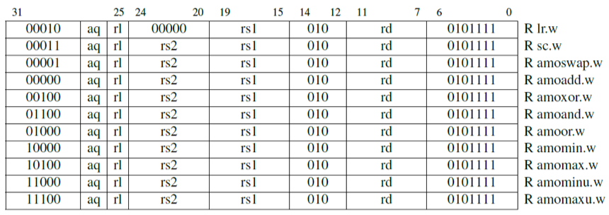

# 6. 原子指令


*所有的事物都应该尽量简单，但是不能太过简单。*

—— 阿尔伯特·爱因斯坦（Albert Einstein），1933

>>>**阿尔伯特·爱因斯坦**（1879-1955），20世纪最著名的科学家。他提出了相对论，在第二次世界大战中提出制造原子弹。
>>>

## 6.1 导言

我们假定你已经了解了ISA对如何支持多进程，所以我们在这儿只对RV32A指令和它们的行为进行解释。如果你觉得需要一些背景知识补充，可以看一下维基百科上的"同步（计算机科学）"词条（[英文维基地址](<https://en.wikipedia.org/wiki/Synchronization)，[中文地址](https://zh.wikipedia.org/wiki/%E5%90%8C%E6%AD%A5)）或者阅读《RISC-V体系结构》2.1节\[Patterson and Hennessy 2017\]。

RV32A有两种类型的原子操作：

-   内存原子操作（AMO）

-   加载保留/条件存储（load reserved / store conditional）

图6.1是RV32A扩展指令集的示意图，图6.2列出了它们的操作码和指令格式。


<center>图6.1 RV32A指令图示</center>



<center>图6.2 RV32A指令格式、操作码、格式类型和名称。（这张图源于[Waterman and Asanovi´c 2017]的表19.2。）</center>

AMO指令对内存中的操作数执行一个原子操作，并将目标寄存器设置为操作前的内存值。原子表示内存读写之间的过程不会被打断，内存值也不会被其它处理器修改。

加载保留和条件存储保证了它们两条指令之间的操作的原子性。加载保留读取一个内存字，存入目标寄存器中，并留下这个字的保留记录。而如果条件存储的目标地址上存在保留记录，它就把字存入这个地址。如果存入成功，它向目标寄存器中写入0；否则写入一个非0的错误代码。

>>>AMO和LR/SC指令要求内存地址对齐，因为保证跨cache行的原子读写的难度很大。
>>>

为什么RV32A要提供两种原子操作呢？因为实际中存在两种不同的使用场景。

编程语言的开发者会假定体系结构提供了原子的比较-交换（compare-and-swap）操作：比较一个寄存器中的值和另一个寄存器中的内存地址指向的值，如果它们相等，将第三个寄存器中的值和内存中的值进行交换。这是一条通用的同步原语，其它的同步操作可以以它为基础来完成\[Herlihy 1991\]。

尽管将这样一条指令加入ISA看起来十分有必要，它在一条指令中却需要3个源寄存器和1个目标寄存器。源操作数从两个增加到三个，会使得整数数据通路、控制逻辑和指令格式都变得复杂许多。（RV32FD的多路加法（multiply-add）指令有三个源操作数，但它影响的是浮点数据通路，而不是整数数据通路。）不过，加载保留和条件存储只需要两个源寄存器，用它们可以实现原子的比较交换（见图6.3的上半部分）。

```assembly
# 用lr/sc实现内存字M[a0]的比较-交换操作。
# 期望的旧的值在a1中；想得到的新的值在a2中。
  0: 100526af		lr.w  a3,(a0)     # 加载旧的值
  4: 06b69e63		bne   a3,a1,80    # 比较旧的值与a1是否相等
  8: 18c526af		sc.w  a3,a2,(a0)  # 相等则存入新的值
  c: fe069ae3		bnez  a3,0        # 如果存入失败，重新尝试
  		… 比较-交换成功之后的代码 …
 80:								  # 比较-交换不成功
 
 # 被使用AMO的测试并设置自旋锁保护的关键段。
  0: 00100293		li           t0,1        # 初始化锁
  4: 0c55232f		amoswap.w.aq t1,t0,(a0)  # 尝试获取锁
  8: fe031ee3		bnez         t1,4        # 如果失败，重新尝试
   		… 关键代码 …
 20: 0a05202f    amoswap.w.rl x0,x0,(a0)  	 # 释放锁。
```

<center>图6.3 同步的两个例子。第一个例子使用加载保留lr.w/条件存储sc.w实现比较-交换操作；第二个例子使用原子交换amoswap.w实现互斥。</center>


另外还提供AMO指令的原因是，它们在多处理器系统中拥有比加载保留/条件存储更好的可扩展性，例如可以用它们来实现高效的归约。AMO指令在于I/O设备通信时也很有用，可以实现总线事务的原子读写。这种原子性可以简化设备驱动，并提高I/O性能。图6.3的下半部分展示了如何使用原子交换实现临界区。

>>**补充说明： 内存一致性模型**
RISC-V具有宽松的内存一致性模型（relaxed memory consistency model），因此其他线程看到的内存访问可以是乱序的。图6.2中，所有的RV32A指令都有一个请求位（aq）和一个释放位（rl）。aq被置位的原子指令保证其它线程在随后的内存访问中看到顺序的AMO操作；rl被置位的原子指令保证其它线程在此之前看到顺序的原子操作。想要了解更详细的有关知识，可以查看[Adve and Gharachorloo 1996]。

**有什么不同之处？** 原始的MIPS-32没有同步机制，设计者在后来的MIPS ISA中加入了加载保留/条件存储指令。

## 6.2 结束语

RV32A是可选的，一个RISC-V处理器如果没有它就会更加简单。然而，正如爱因斯坦所言，一切事物都应该尽量简单，但不应该太过简单。RV32A正是如此，许多的场景都离不开它。

## 6.3 扩展阅读

S. V. Adve and K. Gharachorloo. Shared memory consistency models: A tutorial. *Computer*, 29(12):66--76, 1996.

M. Herlihy. Wait-free synchronization. *ACM Transactions on Programming Languages and Systems*, 1991.

D. A. Patterson and J. L. Hennessy. *Computer Organization and Design RISC-V Edition: The Hardware Software Interface*. Morgan Kaufmann, 2017.

A.  Waterman and K. Asanovi´c, editors. *The RISC-V Instruction Set Manual, Volume I: User-Level ISA, Version 2.2*. May 2017. URL https://riscv.org/specifications/.

## 注

[^1] http://parlab.eecs.berkeley.edu
