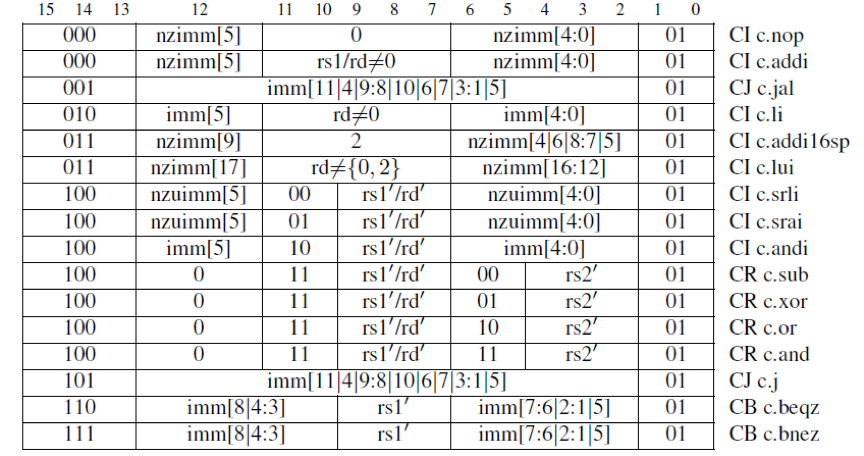
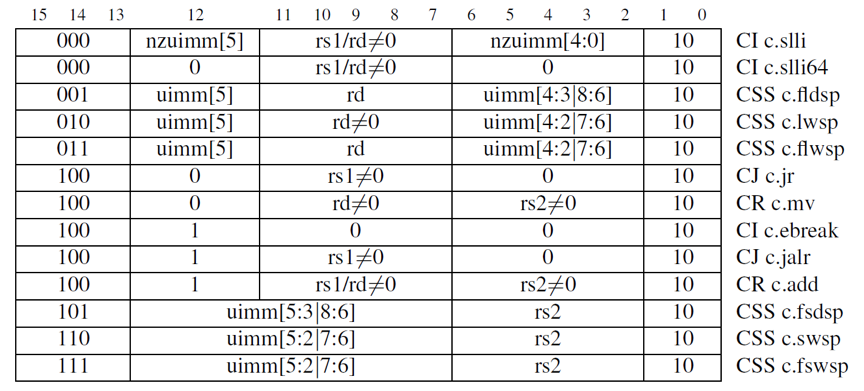

# 7. 压缩指令

>>>E.F.Schumacher（1911-1977）撰写了一本经济学著作，主张人性化，分散化和适当的技术。它被翻译成多种语言，被评为第二次世界大战以来最具影响力的100本书之一。
>>>

小即是美。 —— E. F. Schumacher, 1973

## 7.1 导言

以前的ISA为了缩短代码长度而显著扩展了指令和指令格式的数量，比如添加了一些只有两个（而不是三个）操作数的指令，减小立即数域，等等。ARM和MIPS为了能缩小代码，重新设计了两遍指令集，ARM设计出了ARM Thumb和Thumb 2，MIPS先后设计出了MIPS16和microMIPS。这些新的ISA为处理器和编译器增加了负担，同时也增加了汇编语言程序员的认知负担。

RV32C采用了一种新颖的方法：每条短指令必须和一条标准的32位RISC-V指令一一对应。此外，16位指令只对汇编器和链接器可见，并且是否以短指令取代对应的宽指令由它们决定。编译器编写者和汇编语言程序员可以幸福地忽略RV32C指令及其格式，他们能感知到的则是最后的程序大小小于大多数其它ISA的程序。图7.1是RV32C扩展指令集的图形化表示。


为了能在一系列的程序上得到良好的代码压缩效果，RISC-V架构师精心挑选了RVC扩展中的指令。同时，基于以下的三点观察，架构师们成功地将指令压缩到了16位。第一，对十个常用寄存器（a0-a5，s0-s1，sp以及ra）访问的频率远超过其他寄存器；第二，许多指令的写入目标是它的源操作数之一；第三，立即数往往很小，而且有些指令比较喜欢某些特定的立即数。因此，许多RV32C指令只能访问那些常用寄存器；一些指令隐式写入源操作数的位置；几乎所有的立即数都被缩短了，load和store操作只使用操作数整数倍尺寸的无符号数偏移量。


**图7.1：RV32C的指令图示。移位指令的立即数域和c.addi4spn是零扩展的，其它指令采用符号位扩展。**


**图7.2：用压缩指令集写成的插入排序和DAXPY程序的指令数和代码长度。**

图7.3和7.4列出了插入排序和DAXPY程序的RV32C代码。我们展示了这些RV32C指令，从而清楚地显示了这些压缩操作的效果，但是通常这些指令在汇编程序中是不可见的。注释中在括号内标出了与RV32C指令对应的等效32位指令。附录A中完整列出了16位RV32C指令和32位RISC-V指令的对应关系。

例如，在图7.3的插入排序程序中地址为4的地方，汇编器将如下的32位RV32I指令：
```
addi a4,x0,1 	# i = 1
```
替换为了这条16位RV32C指令：
```
c.li a4,1 		# （可扩展为 addi a4,x0,1） i = 1
```
RV32C的load立即数指令比较短，是因为它只能指定一个寄存器和一个小的立即数。c.li的机器码在图7.3中只有4个十六进制数，这表明c.li指令确实只有2字节长。

另一个例子在图7.3中地址为10的地方，汇编器将：
```
add a2,x0,a3 	# a2是指向a[j]的指针
```
换成了这条16位RV32C指令：
```
c.mv a2,a3 		#（可扩展为add a2,x0,a3） a2是指向a[j]的指针
```
RV32C的move指令只有16位长，因为它只指定两个寄存器。

>>>

尽管处理器的设计者们不能忽略RV32C的存在，但是有一个技巧可以让实现的代价变小：在执行之前用一个解码器将所有的16位指令转换为等价的32位指令。图7.6到7.8列出了解码器可以转换的RV32C指令的格式和操作码。最小的不支持任何扩展的32位RISC-V处理器要用到8000个门电路，而解码器只要400个门。如果它在这么小的设计中都只占5%的体量，那么它在约有100,000个门的中等大小带有cache的处理器中相当于不占资源。

**有什么不同之处？**RV32C中没有字节或半字指令，因为其他指令对代码长度的影响更大。第9页图1.5中Thumb-2相对于RV32C，在代码长度上更有优势，这是由于Load and Store Multiple对于过程（函数、子例程）进入和退出时可以节省不少代码。为了保证能和RV32G中的指令一一对应，RV32C中没有包括它们。而RV32G为了降低高端处理器的实现复杂性而省略了这些指令。由于Thumb-2是独立于ARM-32的ISA，但是处理器可以在两个ISA间切换。为了支持两套ISA，硬件必须有两个指令解码器，一个用于ARM-32，一个用于Thumb-2。RV32GC是一个单独的ISA，因此RISC-V处理器只需要一个解码器。

>>**补充说明：为什么有些架构师不考虑RV32C？**
超标量处理器在一个时钟周期内同时取几条指令，因此译码阶段可能成为超标量处理器的瓶颈。macrofusion是另一个例子，其中指令解码器把RISC-V指令组合为更加强大的指令来执行（参见第一章）。在这种情况下，16位RV32C指令和32位RV32I指令混杂在一起增加了解码的复杂度，从而使得高性能处理器中在一个时钟周期内完成解码变得更难。

## 7.2 RV32GC，Thumb-2，microMIPS和x86-32的比较

图7.2汇总了这四个ISA写成的插入排序和DAXPY程序的代码大小。

在插入排序的原始19条RV32I指令中，12条被替换成了RV32C指令，所以代码长度从$19 \times 4 = 76$个字节变成了$12 \times 2 + 7 \times 4 = 52$ 个字节，节省了 $24/76 = 32\%$。DAXPY程序从 $11 \times 4 = 44$ 个字节缩减到了$8 \times 2 + 3 \times 4 = 28$ 个字节，节省了 $16/44 = 36\%$。

这两个小例子的结果与第二章第9页的图1.5惊人的一致，那里提到说，对于更多更复杂的程序，RV32G代码比RV32GC代码长37%。要达到这种程度的长度缩减，程序中必须有一半的指令可以被替换成RV32C指令。

>>**补充说明：RV32C真的是独一无二的吗？**
RV32指令在RV32IC中无法区分。Thumb-2实际上是一个单独的ISA，包含16位指令和ARMv7中大多数（但不是全部）的指令。例如，在Thumb-2中有Compare and Branch on Zero，而ARMv7中没有，而对于Reverse Subtarct with Carry则正好相反。microMIPS也不是MIPS32的超集。例如，microMIPS计算分支偏移量的时候乘以2，但在MIPS32中则为4。RISC-V中总是乘以2。

## 7.3 结束语

我本可以把信写得更短，但我没有时间。—— Blaise Pascal, 1656

>>>

他是建造了第一台机械计算器的数学家，因此图灵奖得主Niklaus Wirth用他的名字命名了一门编程语言。

RV32C让RISC-V程序拥有了当今几乎最小的代码尺寸。你几乎可以将它们视为硬件协助的伪指令。但是，现在汇编器将它们在汇编语言程序员和编译器编写者面前隐藏起来。这里我们没有像第三章那样，将能提升RISC-V代码易用性与易读性的常用操作的组织成指令，来扩展真实的指令集。这两种方法都有助于提供程序员的工作效率。

>>>

RISC-V提倡用一套简洁、有效的机制来提升性价比，RV32C就是一个极佳的范例。

## 7.4 扩展阅读

A. Waterman and K. Asanovi´c, editors. *The RISC-V Instruction Set Manual, Volume I: User-Level ISA, Version 2.2*. May 2017. URL https://riscv.org/specifications/.

## 注

[^1] http://parlab.eecs.berkeley.edu

**图7.3：插入排序的RV32C代码。12条16位指令使得代码长度缩减了32%。每条指令的宽度可以很容易地得知。RV32C指令（以c.开头）在这个例子中显式出现，但通常汇编语言程序员和编译器无法看到它们。**

```assembly
# RV32DC (11 instructions, 28 bytes)
# a0 is n, a1 is pointer to x[0], a2 is pointer to y[0], fa0 is a
  0: cd09	c.beqz a0,1a			# (expands to beq a0,x0,1a) if n==0, jump to Exit
  2: 050e	c.slli a0,a0,0x3		# (expands to slli a0,a0,0x3) a0 = n*8
  4: 9532	c.add a0,a2				# (expands to add a0,a0,a2) a0 = address of x[n]
Loop:
  6: 2218	c.fld fa4,0(a2)			# (expands to fld fa4,0(a2) ) fa5 = x[]
  8: 219c		c.fld fa5,0(a1)		# (expands to fld fa5,0(a1) ) fa4 = y[]
  a: 0621		c.addi a2,8			# (expands to addi a2,a2,8) a2++ (incr. ptr to y)
  c: 05a1		c.addi a1,8			# (expands to addi a1,a1,8) a1++ (incr. ptr to x)
  e: 72a7f7c3 fmadd.d fa5,fa5,fa0,fa4 # fa5 = a*x[i] + y[i]
 12: fef63c27 fsd fa5,-8(a2)		# y[i] = a*x[i] + y[i]
 16: fea618e3 bne a2,a0,6			# if i != n, jump to Loop
Exit:
 1a: 8082 	  ret					# (expands to jalr x0,ra,0) return from function
```

**图7.4：DAXPY的RV32DC代码。8条十六位指令将代码长度缩减了36%。每条指令的宽度见第二列的十六进制字符个数。RV32C指令（以c.开头）在这个例子中显式出现，但通常汇编语言程序员和编译器无法看到它们。**



**图7.5：RV32C操作码映射（bits\[1:0\] = 01）列出了指令布局，操作码，指令格式和指令名称。rd',rs1'和rs2'指的是10个常用的寄存器a0-a5，s0-s1，sp和ra。（本图来源于\[Waterman and Asanovi´c 2017\]的表12.5。）**


**图7.6：RV32C操作码表（bits\[1:0\] = 00）列出了指令布局，操作码，指令格式和指令名称。rd',rs1'和rs2'指的是10个常用的寄存器a0-a5，s0-s1，sp和ra。（本图来源于\[Waterman and Asanovi´c 2017\]的表12.4。）**



**图7.7：RV32C操作码表（bits\[1:0\] = 10）列出了指令布局，操作码，指令格式和指令名称。（本图来源于\[Waterman and Asanovi´c 2017\]的表12.6。）**


**图7.8：16位RVC压缩指令的格式。rd',rs1'和rs2'指的是10个常用的寄存器a0-a5，s0-s1，sp和ra。（本图来源于\[Waterman and Asanovi´c 2017\]的表12.1。）**
