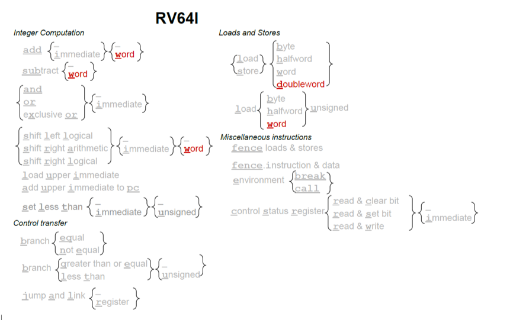
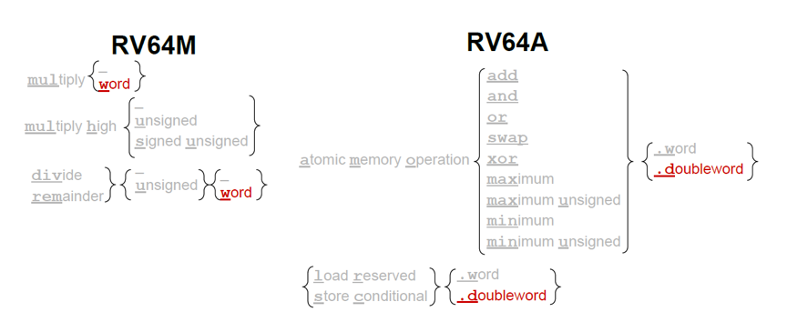
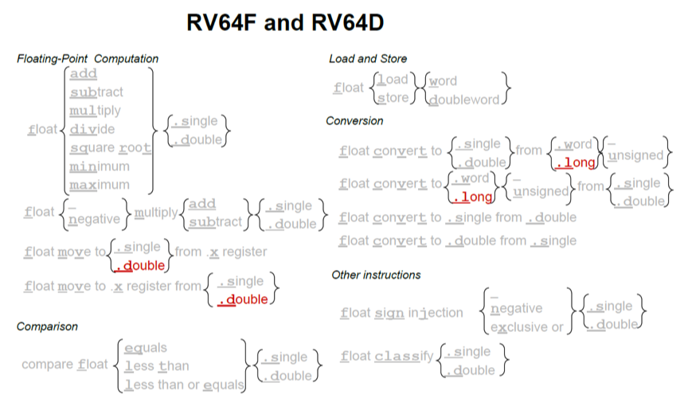
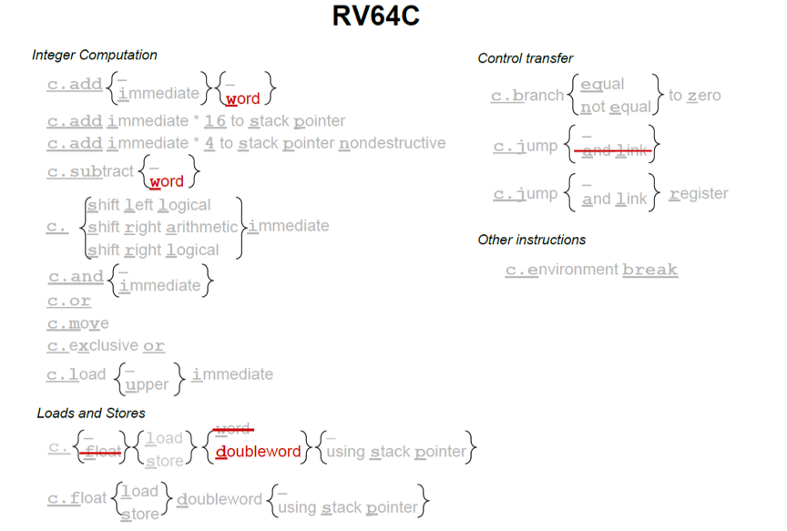
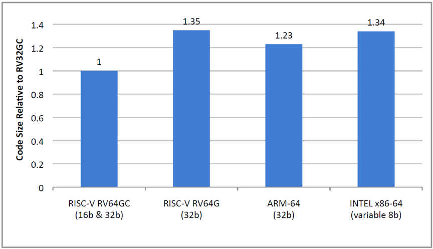

# 9. RV64：64位地址指令

*在计算机设计中只能出现一个错误是难以恢复的 —— 没有足够的地址位用于存储器寻址和存储器管理。*

—— C. Gordon Bell, 1976

>>>**C. Gordon Bell** (1934-) 是当时最受欢迎的两种小型机架构的首席架构师之一：1970年宣布的数字设备公司PDP-11（16位地址）及其七年后的继任者，数字设备公司32 位地址VAX-11（虚拟地址扩展）。
>>>

## 9.1 导言

图9.1至9.4是RV32G指令集的64位版本RV64G指令集的图示。由图可见，要切换到64位ISA，ISA只添加了少数指令。指令集只添加了32位指令对应的字(word)，双字(doubleword)和长整数(long)版本的指令，并将所有寄存器（包括PC）扩展为64位。因此，RV64I中的sub操作的是两个64位数字而不是RV32I中的32位数字。RV64很接近RV32但实际上又有所不同；它添加了少量指令同时基础指令做的事情与RV32中稍有不同。

例如，图9.8中RV64I版本的插入排序与第2章第27页的图2.8中RV32I版本的插入排序非常相似。它们指令数量和大小都相同。唯一的变化是加载和存储字指令变为加载并存储双字，地址增量从对应字的4（4字节）变为对应双字的8（8字节）。图9.5列出了图9.1到9.4中的RV64GC指令的操作码。

尽管RV64I有64位地址且默认数据大小为64位，32位字仍然是程序中的有效数据类型。因此，RV64I需要支持字，就像RV32I需要支持字节和半字一样。更具体地说，由于寄存器现在是64位宽，RV64I添加字版本的加法和减法指令：addw，addiw，subw。这些指令将计算结果截断为32位，结果符号扩展后再写入目标寄存器。RV64I也包括字版本的移位指令（sllw，slliw，srlw，srliw，sraw，sraiw），以获得32位移位结果而不是64位移位结果。要进行64位数据传输，RV64提供了加载和存储双字指令：ld，sd。最后，就像RV32I中有无符号版本的加载单字节和加载半字的指令，RV64I也有一个无符号版本的加载字：lwu。

出于类似的原因，RV64需要添加字版本的乘法，除法和取余指令：mulw，divw，divuw，remw，remuw。为了支持对单字及双字的同步操作，RV64A为其所有的11条指令都添加了双字版本。




<center>图9.1：RV64I指令图示。带下划线的字母从左到右连起来构成RV64I指令。灰色部分是扩展到64位寄存器的旧RV64I指令，而暗（红色）部分是RV64I的新指令。</center>



<center>图9.2：RV64M和RV64A指令图示</center>



<center>图9.3：RV64F和RV64D指令图</center>




<center>图9.4L：RV64C指令图</center>


<center>图9.5：RV64基本指令和可选扩展指令的的操作码表。这张图包含了指令布局，操作码，格式类型和名称(基于[Waterman and Asanovic 2017]的表19.2）。</center>

RV64F和RV64D添加了整数双字转换指令，并称它们为长整数，以避免与双精度浮点数据混淆：fcvt.l.s，fcvt.l.d，fcvt.lu.s，fcvt.lu.d，fcvt.s.l，fcvt.s.lu，fcvt.d.l，fcvt.d.lu.由于整数x寄存器现在是64位宽，它们现在可以保存双精度浮点数据，因此RV64D增加了两个浮点指令：fmv.x.w和fmv.w.x。

> > > 

RV64和RV32之间基本是超集关系，但是有一个例外是压缩指令。RV64C取代了一些RV32C指令，因为其他一些指令对于64位地址可以取得更好的代码压缩效果。RV64C放弃了压缩跳转并链接（c.jal）和整数和浮点加载和存储字指令（c.lw，c.sw，c.lwsp，c.swsp，c.flw，c.fsw，c.flwsp和c.fswsp）。在他们的位置，RV64C添加了更受欢迎的字加减指令（c.addw，c.addiw，c.subw）以及加载和存储双字指令（c.ld，c.sd，c.ldsp，c.sdsp）。

>>**补充说明：RV64 ABI包括lp64，lp64f和lp64d**
>>lp64表示C语言中的长整型以及指针类型为64位; 整型仍然是32位。与RV32（见第3章）相同，后缀f和d表示如何传递浮点参数。

>>**补充说明：RV64V没有指令图示**
是因为有动态寄存器类型的存在，它与RV32V的完全一致。唯一的变化是第75页的图8.2中的X64和X64U动态寄存器类型仅在RV64V中出现，RV32V并不支持。


## 9.2 使用插入排序来比较RV64与其他64位ISA

正如GordonBell在本章开头所说，一个架构致命的缺陷是用光了地址位。随着程序使用的内存大小逐渐逼近32位地址空间的极限，不同指令集的架构师开始了设计他们指令集的64位地址版本\[Mashey 2009\]。

最早的是MIPS，在1991年，它将所有寄存器以及程序计数器从32扩展至64位并添加了新的64位版本的MIPS-32指令。MIPS-64汇编语言指令都以字母"d"开头，例如daddu或dsll（参见图9.10）。程序员可以在同一个程序中混合使用MIPS-32和MIPS-64指令。MIPS-64删除了MIPS-32中的加载延迟槽（流水线在侦测到写后读相关时会停止）。

> > > 

十年之后，是x86-32指令集也迎来了64位。架构师们在拓展地址空间的同时，也借机在x86-64中进行了一系列改进：

-   整数寄存器的数量从8增加到16（r8-r15）;

-   将SIMD寄存器的数量从8增加到16（xmm8-xmm15）并且添加了PC相关数据寻址，以更好地支持与位置无关的代码；

-   添加了PC相关数据寻址，以更好地支持与位置无关的代码。

这些改进部分缓和了x86-32指令集长久以来的一些弊端。

> > > 

通过比较插入排序的x86-32版本（第2章第30页上图2.11中）和x86-64版本（图9.11中）的指令，我们可以发现x86-64指令集的优势。新的64位ISA将所有变量分配在寄存器中，而不是像x86-32一样，要将多个变量保存到内存中，这将指令的数量从20条减少到了15条。尽管64位代码指令数量比32位少，但是代码大小实际上要大一个字节，从45变成了46字节。原因是为了挤进新的操作码以便操作更多的寄存器，x86-64添加了一个前缀字节来识别新指令。从x86-32到x86-64平均指令长度增长了。

|ISA |ARM-64 |MIPS-64 |X86-64 |RV64I |RV64I+RV64C |
|-|-|-|-|-|-|
|指令数|16|24|15|19|19|
|字节数|64|96|46|76|52|

<center>图9.6：四个ISA的插入排序的指令数和代码大小。ARM Thumb-2和microMIPS是32位地址ISA，因此不适用于ARM-64和MIPS-64。</center>

> > > 

又过了十年，ARM也遇到了同样的地址问题。但是他们没有像x86-64那样，把旧的ISA扩展到支持64位地址。他们利用这个机会发明了一个全新的ISA。从头设计一个新ISA，使得他们不必继承ARM-32的许多尴尬特性，他们重新设计了一个现代ISA：

-   将整数寄存器的数量从15增加到31；

-   从寄存器组中删除PC；

-   为大多数指令提供硬连线到零的寄存器（r31）；

-   与ARM-32不同，ARM-64的所有数据寻址模式都适用于所有数据大小和类型；

-   ARM-64去除了ARM-32的加载存储多个数据的指令；

-   ARM-64去除了ARM-32指令的条件执行选项。

ARM-32的一些弱点依然存在于ARM-64指令集中：分支指令使用的条件码，指令中源和目标寄存器字段并不固定，条件移动指令，复杂寻址模式，不一致的性能计数器，以及只支持32位长度的指令。另外ARM-64无法切换到Thumb-2 ISA，因为Thumb-2仅适用于32位地址。

与RISC-V不同，ARM决定采用最大主义的方法来设计ISA。虽然ISA比ARM-32更好，但它也更大。例如，它有超过1000条指令并且ARM-64手册长3185页\[ARM 2015\]。而且，它的指令数仍然在增长。自公布几年以来，ARM-64已经经历了三次扩展。

> >>**英特尔并没有发明x86-64 ISA**。 当向64位地址转换时，英特尔发明了一种名为Itanium的新ISA，它与x86-32不兼容。x86-32处理器的竞争对手被拦在了Itanium的门外，因此AMD发明了一款名为AMD64的64位版x86-32。Itanium最终失败了，因此英特尔被迫采用AMD64 ISA作为x86-32的64位地址继承者，我们称之为x86-64 [Kerner & Padgett 2007]。

图9.9中插入排序的ARM-64代码看起来更接近RV64I代码或x86-64代码，而不太像ARM-32代码。例如，因为有31个寄存器可用，就没有必要从堆栈中保存和恢复寄存器。而且由于PC不再存放于通用寄存器中，ARM-64单独增加了一条返回指令。

图9.6总结了插入排序在不同ISA下的指令数和字节数。图9.8到9.11显示了RV64I，ARM-64，MIPS-64和x86-64的代码。这四段代码注释中括号内的短语阐明了第2章中的RV32I版本与这些RV64I版本之间的差异。

MIPS-64用到了最多的指令，主要是因为它需要使用nop指令来填充无法有效利用起来的分支延迟槽。由于比较和分支用一条指令完成，而且分支指令没有延迟槽，RV64I需要的指令更少。虽然相较于RV64I，对于每个分支，ARM-64和x86-64需要多使用两条指令，但它们的缩放寻址模式避免了RV64I中所需的地址算术指令，可以让它们少使用一些指令。但是总的而言，RV64I + RV64C代码大小要小得多，具体原因会在下一节阐述。



<center>图9.7：RV64G，ARM-64和x86-64与RV64GC的相对程序大小比较。我们使用了比图9.6中更大的程序来进行对比。该图第2章中第9页的图1.5中的32位ISA比较的对应的64位ISA比较.RV32C代码大小与RV64C几乎一致;仅比RV64C小1％。ARM-64没有Thumb-2选项，因此其他64位ISA的代码大小明显大于RV64GC代码。测量的程序是SPEC CPU2006基准测试，使用的GCC编译器[Waterman 2016]。</center>

> >**补充说明：ARM-64，MIPS-64和x86-64不是官方名称**
> >
> >他们的官方名称是：我们所说的ARM-64 实则是ARMv8，MIPS-64是MIPS-IV和x86-64是AMD64（有关x86-64的历史记录，请参见上一页的侧栏）。

## 9.3 程序大小

>>>

>>>

>>>

图9.7比较了RV64，ARM-64和x86-64的平均相对代码大小。将这个图见第1章第9页的图1.5比较。首先，RV32GC代码的大小与RV64GC几乎相同;它只比RV64GC小1％。RV32I和RV64I的代码大小也很接近。而ARM-64代码比ARM-32代码小8％，由于没有64位地址版本的Thumb-2，所以所有指令都保持32位长。因此，ARM-64代码比ARMThumb-2代码大25％。由于添加了前缀操作码以装下新的指令以及扩展的寄存器，x86-64的代码比x86-32代码大7％。因此，就程序大小而言，RV64GC更优秀，因为ARM-64代码比RV64GC大23％，x86-64代码比RV64GC大34％。程序大小的差异如此得大，以至于RV64可以较低的指令高速缓存缺失率来提供更高的性能，或者可以使用更小的指令缓存来降低成本，但依然能提供令人满意的缺失率。

## 9.4 结束语

*成为先驱者的一个问题是你总是犯错误，而我永远不会想成为先驱者。最好是在看到先驱者所犯的错误后，赶紧来做这件事情，成为第二个做这件事情的人。*

—— Seymour Cray，第一台超级计算机的架构师，1976年

>>>MIPS正在出售。Imagination Technologies于2012年以1亿美元收购了MIPS ISA，最近宣布将其出售；还没有买家。

耗尽地址位是计算机体系结构的致命弱点，许多架构因为这个缺点而消亡。ARM-32和Thumb-2仍然是32位架构，所以他们对大型程序没有帮助。像MIPS-64和x86-64这样的一些ISA在转型中幸存下来，但x86-64并不是ISA设计的典范，而写这篇文章的时候，MIPS-64的前路依然迷茫。ARM-64是一个新的大型ISA，时间会告诉我们它会有多成功。

>>>

>>>

>>>

>>>

RISC-V受益于同时设计32位和64位架构，而较老的ISA必须依次设计它们。不出所料，对于RISC-V程序员和编译器编写者来说，32位到64位之间的过渡是最简单的；RV64I ISA几乎包含了所有RV32I指令。这也就是为什么我们只用两页参考卡片，就可以列出RV32GCV和RV64GCV指令集。更重要的是，同步设计意味着64位架构指令集不必被狭窄的32位操作码空间限制。RV64I有足够的空间用于可选的指令扩展，特别是RV64C，这使它成为代码大小比其他所有64位ISA都要小。

我们认为64位架构更能体现RISC-V设计上的优越性，毕竟我们设计64位ISA比先行者们晚了20年，这样我们可以可以学习先行者们的好的设计并从他们的错误中吸取教训。

>>**补充说明：RV128**
>>RV128最初是作为RISC-V架构师内部的一个玩笑话，只是为了显示128位地址的ISA是可能的。但是，仓库规模的计算机可能很快就会拥有超过264字节存储容量的半导体存储器（DRAM和闪存），同时程序员可能会想要用访问内存的方式来访问这些存储。同时还有人[伍德拉夫等人 2014]提议使用128位地址来提高安全性。 RISC-V手册确实指定了一个完整的128位ISA叫做RV128G [Waterman and Asanovic 2017]。如图9.1至9.4所示，新增的指令基本上是与从RV32切换到RV64新增的指令类似。所有的寄存器也增长到128位，新的RV128指令要么指定了128位版本的指令（指令名称中使用Q，意为四字（quadword））或其他指令的64位版本（指令名称中使用D，意为双字（double word）的）。


## 9.5 扩展阅读

I. ARM. Armv8-a architecture reference manual. 2015.

M. Kerner and N. Padgett. A history of modern 64-bit computing. Technical report, CS Department,University of Washington, Feb 2007. URL http://courses.cs.washington.edu/courses/csep590/06au/projects/history-64-bit.pdf.

J. Mashey. The long road to 64 bits. *Communications of the ACM*, 52(1):45--53, 2009.  

A.Waterman. *Design of the RISC-V Instruction Set Architecture*. PhD thesis, EECS Department, University of California, Berkeley, Jan 2016. URL http://www2.eecs.berkeley.edu/Pubs/TechRpts/2016/EECS-2016-1.html.

A. Waterman and K. Asanovi´c, editors. *The RISC-V Instruction Set Manual, Volume I: User-Level ISA, Version 2.2*. May 2017. URL https://riscv.org/specifications/.

J. Woodruff, R. N. Watson, D. Chisnall, S. W. Moore, J. Anderson, B. Davis, B. Laurie, P. G. Neumann, R. Norton, and M. Roe. The CHERI capability model: Revisiting RISC in an age of risk. In *Computer Architecture (ISCA), 2014 ACM/IEEE 41st International Symposium on*, pages 457--468. IEEE, 2014.

## 注

[^1] http://parlab.eecs.berkeley.edu

```assembly
# RV64I (19 instructions, 76 bytes, or 52 bytes with RV64C)
# a1 is n, a3 points to a[0], a4 is i, a5 is j, a6 is x
   0: 00850693 addi a3,a0,8 	# (8 vs 4) a3 is pointer to a[i]
   4: 00100713 li a4,1 			# i = 1 Outer Loop:
   8: 00b76463  bltu  a4,a1,10  # if i < n, jump to Continue Outer loop
Exit Outer Loop:
   c: 00008067  ret				# return from function
Continue Outer Loop:
  10: 0006b803  ld	a6,0(a3) 	# (ld vs lw) x = a[i]
  14: 00068613  mv	a2,a3 		# a2 is pointer to a[j]
  18: 00070793  mv	a5,a4 		# j = i
Inner Loop:
  1c: ff863883 ld	a7,-8(a2)  	# (ld vs lw, 8 vs 4) a7 = a[j-1]
  20: 01185a63 ble	a7,a6,34   	# if a[j-1] <= a[i], jump to Exit Inner Loop
  24: 01163023 sd	a7,0(a2)   	# (sd vs sw) a[j] = a[j-1]
  28: fff78793 addi a5,a5,-1 	# j--
  2c: ff860613 addi a2,a2,-8 	# (8 vs 4) decrement a2 to point to a[j] 
  30: fe0796e3 bnez a5,1c 		# if j != 0,jump to Inner Loop
Exit Inner Loop:
  34: 00379793  slli  a5,a5,0x3 # (8 vs 4) multiply a5 by 8
  38: 00f507b3  add   a5,a0,a5	# a5 is now byte address oi a[j] 
  3c: 0107b023  sd    a6,0(a5)	# (sd vs sw) a[j] = x
  40: 00170713  addi  a4,a4,1	# i++
  44: 00868693  addi  a3,a3,8	# increment a3 to point to a[i]
  48: fc1ff06f  j     8			# jump to Outer Loop # continue outer loop
```

<center>图9.8：图2.5中插入排序的RV64I代码。RV64I汇编语言程序与第2章中第27页的图2.8中的RV32I汇编语言程序类似。我们在注释中的括号内列出了差异。数据的大小现在是8个字节而不是4个，所以三条指令中的常数从4变到了8.由于数据宽度的变化，两个加载字（lw）相应变成了加载双字（ld）和两个存储字（sw）相应变成了存储双字（sd）。</center>

```assembly
# ARM-64 (16 instructions, 64 bytes)
# x0 points to a[0], x1 is n, x2 is j, x3 is i, x4 is x
  0: d2800023  mov  x3, #0x1	# i = 1
  4: eb01007f  cmp  x3, x1		# compare i vs n
  8: 54000043  b.cc 10			# if i < n, jump to Continue Outer loop
Outer Loop:
  c: d65f03c0  ret              # return from function
Continue Outer Loop:
 10: f8637804  ldr  x4, [x0, x3, lsl #3] # (x4 ca r4) vs x = a[i]
 14:aa0303e2 mov x2,x3			#(x2vsr2)j=i
Inner Loop:
 18: 8b020c05  add  x5, x0, x2, lsl #3	# x5 is pointer to a[j]
 1c: f85f80a5  ldur x5, [x5, #-8]	# x5 = a[j]
 20: eb0400bf  cmp  x5, x4		# compare a[j-1] vs. x
 24: 5400008d  b.le 34			# if a[j-1]<=a[i], jump to Exit Inner Loop
 28: f8227805  str  x5, [x0, x2, lsl #3] # a[j] = a[j-1]
 2c: f1000442  subs x2, x2, #0x1         # j--
 30: 54ffff41  b.ne 18                   # if j != 0, jump to Inner Loop
Exit Inner Loop:
 34: f8227804  str  x4, [x0, x2, lsl #3] # a[j] = x
 38: 91000463  add  x3, x3, #0x1         # i++
 3c: 17fffff2  b    4                    # jump to Outer Loop
```

<center>图9.9：图2.5所示的插入排序的ARM-64代码。ARM-64汇编语言程序是第2章中第30页图2.11中的ARM-32汇编语言不同，它是一套全新的指令系统。寄存器以x开始而不是以a开头。数据寻址模式支持将寄存器移位3位用于将索引缩放为字节地址。使用31个寄存器，所以无需保存和恢复寄存器堆栈。由于PC不是寄存器之一，因此它使用了单独的返回指令。事实上，代码看起来更接近RV64I代码或x86-64代码而不是ARM-32代码。</center>

```assembly
# MIPS-64 (24 instructions, 96 bytes)
# a1 is n, a3 is pointer to a[0], v0 is j, v1 is i, t0 is x
0: 64860008 daddiu a2,a0,8	# (daddiu vs addiu, 8 vs 4) a2 is pointer to a[i]
  4: 24030001 li	v1,1		# i = 1
Outer Loop:
  8: 0065102b sltu	v0,v1,a1	# set on i < n
  c: 14400003 bnez	v0,1c		# if i < n, jump to Continue Outer Loop
 10: 00c03825 move	a3,a2		# a3 is pointer to a[j] (slot filled)
 14: 03e00008 jr	ra			# return from function
 18: 00000000 nop				# branch delay slot unfilled
Continue Outer Loop:
 1c: dcc80000 ld	a4,0(a2)	# (ld vs lw) x = a[i]
 20: 00601025 move	v0,v1		# j = i
Inner Loop:
 24: dce9fff8 ld	a5,-8(a3)	# (ld vs lw, 8 vs. 4, a5 vs t1) a5 = a[j-1]
 28: 0109502a slt	a6,a4,a5	# (no load delay slot) set a[i] < a[j-1]
 2c: 11400005 beqz	a6,44		# if a[j-1] <= a[i], jump to Exit Inner Loop
 30: 00000000 nop				# branch delay slot unfilled
 34: 6442ffff daddiu v0,v0,-1  	# (daddiu vs addiu) j--
 38: fce90000 sd     a5,0(a3)  	# (sd vs sw, a5 vs t1) a[j] = a[j-1]
 3c: 1440fff9 bnez   v0,24     	# if j != 0, jump to Inner Loop (next slot filled)
 40: 64e7fff8 daddiu a3,a3,-8  	# (daddiu vs addiu, 8 vs 4) decr a2 pointer to a[j]
Exit Inner Loop:
 44: 000210f8 dsll   v0,v0,0x3 	# (dsll vs sll)
 48: 0082102d daddu  v0,a0,v0  	# (daddu vs addu) v0 now byte address oi a[j]
 4c: fc480000 sd     a4,0(v0)  	# (sd vs sw) a[j] = x
 50: 64630001 daddiu v1,v1,1	# (daddiu vs addiu) i++
 54: 1000ffec b      8			# jump to Outer Loop (next delay slot filled)
 58: 64c60008 daddiu a2,a2,8	# (daddiu vs addiu, 8 vs 4) incr a2 pointer to a[i]
 5c: 00000000 nop				# Unncessary(?)
```

<center>图9.10：图2.5中所示的插入排序的MIPS-64代码。MIPS-64汇编语言程序与第2章第29页图2.10中的MIPS-32汇编语言有一些不同之处。首先，对于64位数据的大多数操作都在其名称前加上"d"：daddiu，daddu，dsll。如图9.8，由于数据大小从4字节增加到8字节，因此有三条指令将常量从4更改为8。再次与RV64I类似，增加的数据宽度，使得两个加载字（lw）变成了加载双字（ld），两个存储字（sw）变成了存储双字（sd）。最后，MIPS-64没有了MIPS-32中的加载延迟槽；当出现写后读依赖时，流水线会阻塞。</center>

```assembly
# x86-64 (15 instructions, 46 bytes)
# rax is j, rcx is x, rdx is i, rsi is n, rdi is pointer to a[0]
  0: ba 01 00 00 00 mov edx,0x1
Outer Loop:
5:4839 f2			cmp rdx,rsi			# compare i vs. n
8:7323				jae 2d <Exit Loop>	# if i >= n, jump to Exit Outer Loop
a:488b 0c d7		mov rcx,[rdi+rdx*8]	# x = a[i]
e:4889 d0			mov rax,rdx			# j = i
Inner Loop:
 11: 4c 8b 44 c7 f8 mov r8,[rdi+rax*8-0x8] # r8 = a[j-1]
 16: 49 39 c8		cmp r8,rcx			# compare a[j-1] vs. x
 19: 7e 09			jle 24 <Exit Loop>	# if a[j-1]<=a[i],jump to Exit InnerLoop
 1b: 4c 89 04 c7	mov [rdi+rax*8],r8	# a[j] = a[j-1]
 1f: 48 ff c8		dec rax				# j--
 22: 75 ed			jne 11 <Inner Loop>	# if j != 0, jump to Inner Loop
Exit InnerLoop:
 24: 48 89 0c c7	mov [rdi+rax*8],rcx	# a[j] = x
 28: 48 ff c2		inc rdx				# i++
 2b: eb d8			jmp 5 <Outer Loop>	# jump to Outer Loop
Exit Outer Loop:
 2d: c3				ret					# return from function
```

<center>图9.11：图2.5中插入排序的x86-64代码。x86-64汇编语言程序与第2章中第30页图2.11中的x86-32汇编语言非常不同。首先，与RV64I不同，较宽的寄存器有不同的名称rax，rcx，rdx，rsi，rdi，r8。第二，因为x86-64增加了8个寄存器，现在可以将所有变量保存在寄存器而不是内存中。第三，x86-64指令比x86-32更长，因为许多指令需要预先添加8位或16位前缀码，才能使得操作码空间中放得下这些新指令。例如，递增或递减寄存器（inc，dec）在x86-32中只需要1字节，但x86-64中需要3个字节。因此，对于Insertion Sort，虽然x86-64指令数比x86-32少，但代码大小为几乎与x86-32相同：45个字节对46个字节。</center>
